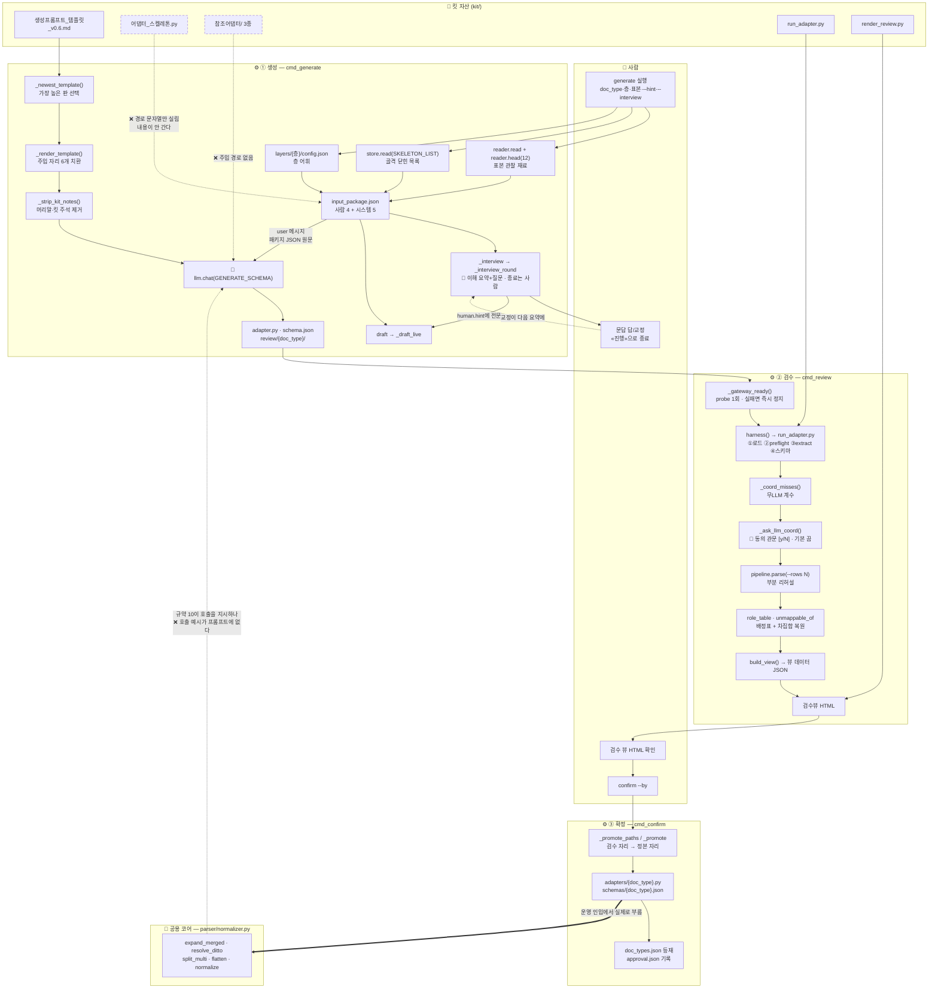

# 등록 파이프라인 구조도 — 함수 수준

> **무엇**: `cli/register.py`의 3단(생성·검수·확정)이 어떤 함수를 거쳐 무엇을 주고받는지.
> **왜 지금**: 사내 실물 등록에서 *"생성된 어댑터의 `extract` 구조가 참조 어댑터와 다르고 `normalizer`를 안 쓴다"*는 관찰이 나왔다. 배선을 따라가 **끊긴 자리 3곳**을 찾았다(§3).
> **정본**: 문서 6 §6.4~6.7. 이 문서는 설명서다 — 갈리면 명세가 이긴다.

## 1. 한 장 지도

## 2. 함수별 — 누가 무엇을 하나

### ① 생성 `cmd_generate(doc_type, layer, samples, hint, interview)`

| 순 | 함수 | 하는 일 | 산출 |
|---|---|---|---|
| 1 | `reader.read` → `reader.head(…, 12)` | 표본을 열어 앞 12줄 관찰 재료 | `system.reader_head` |
| 2 | `store.read(SKELETON_LIST)` | 골격 닫힌 목록 **스냅샷**(층 자산 아님) | `system.skeleton_closed_list` |
| 3 | `layers/{층}/config.json` 로드 | 카테고리·관계·패턴 | `system.layer_vocabulary` |
| 4 | — | 패키지 조립 (**사람 4 + 시스템 5**) | `input_package.json` |
| 5 | `_interview` → `_interview_round` | `--interview`일 때만. 매 라운드 이해 요약+질문, **종료는 사람** | `human.hint.interview` |
| 6 | `draft` → `_draft_live` | 지시문 조립 후 실호출 | |
| 6a | `_newest_template()` | `kit/`에서 **가장 높은 판** 선택 (지금 v0.6) | |
| 6b | `_render_template()` | 주입 자리 6개 치환 (층 어휘·골격 목록·블록) | system 메시지 |
| 6c | `_strip_kit_notes()` | 머리말·「킷 유지 규칙」 제거 — LLM은 못 본다 | |
| 6d | `llm.chat(GENERATE_SCHEMA)` | system=지시문 · **user=패키지 JSON 원문** | `adapter_py`·`schema_json` |
| 7 | `_write_schema` / `_pretty_json` | 잎 한 줄 표기(B23) | `review/{doc_type}/` |

### ② 검수 `cmd_review(doc_type, instruct, rows, llm_coord)`

| 순 | 함수 | 하는 일 |
|---|---|---|
| 1 | `_gateway_ready()` | `probe()` 왕복 1회 — 실패면 **즉시** 정지(B19·⑥) |
| 2 | `harness()` | `kit/run_adapter.py`를 **그대로 부른다**(재작성 아님) — ①로드(순수성·금지 import) ②preflight(지문 대조) ③extract 실행+계약 self-check ④스키마 정합+role 드라이런 |
| 3 | `_coord_misses()` | 좌표 미스를 **무LLM으로 먼저 센다** |
| 4 | `_ask_llm_coord()` | `미스 N건 — 켤까? [y/N]` **기본 끔**(B22) |
| 5 | `pipeline.parse(rows=N)` | 부분 리허설 — 뷰에 「전 M행 중 앞 N행」 표시 |
| 6 | `role_table` · `unmappable_of` | 배정표(6지선다) + UNMAPPABLE **차집합 복원** |
| 7 | `build_view` → `render_review.py` | 뷰 데이터 JSON → 정적 HTML (**렌더러는 계산하지 않는다**) |

### ③ 확정 `cmd_confirm(doc_type, approved_by)`

`_promote` — 검수 산출 자리 → **정본 자리**(`adapters/{doc_type}.py`·`schemas/{doc_type}.json`) 이동 + `doc_types.json` 등재 + `approval.json`(승인자·시점·수정 지시 이력). **승인자 없이는 등재하지 않는다.**

## 3. 끊긴 자리 3곳 — 사용자 관찰의 원인

**증상**: 생성된 어댑터의 `extract` 구조가 참조 어댑터와 다르고 `normalizer`를 안 쓴다.

| # | 결함 | 실측 |
|---|---|---|
| **①** | **어댑터 스켈레톤이 내용이 아니라 경로 문자열로 실린다** | `register.py:635` — `"adapter_skeleton": str((KIT/"어댑터_스켈레톤.py").relative_to(ROOT))`. LLM이 받는 것은 `"kit/어댑터_스켈레톤.py"`라는 **글자 열 개**다 |
| **②** | **참조 어댑터 few-shot을 주입하는 경로가 없다** | `grep -rn 참조어댑터 --include=*.py cli/ core/` → **0건**. 킷 #4는 자산으로만 존재하고 프롬프트에 실리지 않는다 |
| **③** | **템플릿 산출 예시의 `extract`가 본문 없는 시그니처뿐** | 전송분 「산출물 1」이 `def extract(raw) -> list[dict]:` + docstring에서 끝난다. 규약 10은 **산문으로** 호출을 지시하나 **구조 예시가 없다** |

**그래서 무슨 일이 벌어지나.** 명세 §6.5는 스켈레톤을 시스템 5키의 하나로 두고 *"ADAPTER 선언(expects 빈칸)+extract 뼈대 — **LLM은 빈칸을 채운다**"*라고 정한다. 그런데 **빈칸을 받은 적이 없으니 채울 수가 없다** — LLM은 `extract` 본문 전체를 매번 새로 작문한다. 구조가 문서마다 다른 것이 당연하고, `normalizer` 호출은 산문 지시 하나에만 기대게 된다.

**부수 귀결**: B27이 참조 어댑터를 「모범 전시물」로 격상시켰는데, **그 전시장을 아무도 관람하지 않는다.** 전시물을 봐야 할 유일한 관객(생성 LLM)에게 가는 경로가 없다.

### 처방 방향 (허브 제안 — 요청문으로 발주)

1. **스켈레톤을 내용으로 싣는다** — `adapter_skeleton`을 경로에서 파일 본문으로. 시스템 5키는 그대로(키 수 불변, 값의 형태만 바뀜).
2. **참조 어댑터 1종을 few-shot으로 주입** — 표본의 `payload_kind`에 맞는 것 하나(table이면 cp, prose면 toc_report). 전량은 프롬프트가 비대해진다.
3. **명세 정합** — §6.5 시스템 5키의 「어댑터 스켈레톤」이 **내용**임을 문면에 못박고, §6.7 킷 #4에 **주입 대상**임을 명시. 지금은 "few-shot"이라 부르면서 아무 데도 안 실린다.
4. **회귀 어서션** — *"전송 프롬프트에 스켈레톤 본문과 참조 어댑터가 실린다"*. 어서션이 없는 자리는 초록이 지켜주지 않는다.
