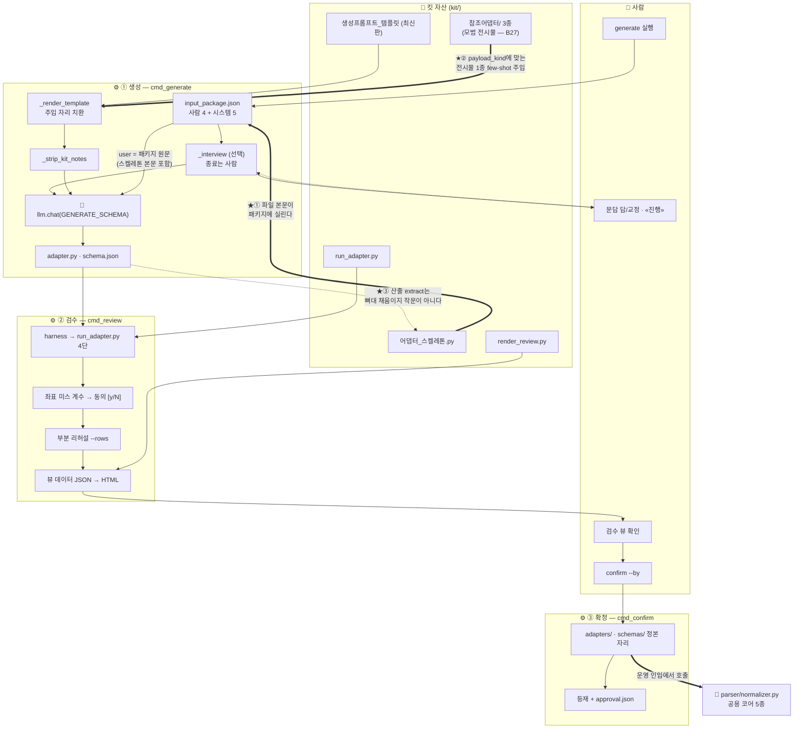

# 등록 파이프라인 구조도 — 개선 기준 (B29 반영 후의 모습)

> **지위**: 이것이 **되어야 하는 모습**이다(to-be). 현재 실물은 `register_구조도.md`(as-is — 끊긴 자리 3곳 표시)가 정확하고, 그 판은 **B29 완료의 대조 기준으로 보존**한다. 구현 완료 보고가 오면 이 문서가 현행 구조도가 되고, as-is 판은 머리에 「역사 — B29 이전」을 단다.
> **정본**: 문서 6 §6.5(시스템 5키 — 스켈레톤은 본문) · §6.7 킷 #4(전시물 주입) · 개정 B29.

## 1. 한 장 지도 — 바뀐 곳은 굵은 화살표 셋

★①②③이 B29의 전부다. 나머지 흐름(문답·리허설·동의 관문·확정)은 현행 그대로 유지된다.

## 2. 무엇이 왜 바뀌나 — 대조표

| 자리 | 현재 (as-is) | 기준 (to-be) | 성립 근거 |
|---|---|---|---|
| 패키지의 `adapter_skeleton` | 경로 문자열 `"kit/어댑터_스켈레톤.py"` | **파일 본문 전체** — LLM이 빈칸을 눈앞에 둔다 | §6.5: *"LLM은 빈칸을 채운다"* — 빈칸을 받아야 채운다 |
| 참조 어댑터 | 자산으로만 존재, 주입 0건 | **표본 payload_kind에 맞는 1종**을 `_render_template`가 few-shot으로 주입 (table→cp · prose→toc_report) | §6.7 킷 #4: 전시물의 관객은 생성 세션이다 |
| 산출 extract의 성격 | 매번 새로 작문 — 구조가 등록마다 다름 | **뼈대 채움** — 구조는 스켈레톤이 고정하고, 생성분은 `expects` 선언 + 문서 고유 후처리 한두 줄 | 규약 10 + 스켈레톤 뼈대의 normalizer 호출 |
| 시스템 키 수 | 5 | **5 그대로** — 키 수는 명세이고 회귀가 센다. 바뀌는 것은 값의 형태뿐 | §6.5 |
| 회귀 | 주입 여부를 아무도 안 잼 | **어서션 신설**: 전송 프롬프트에 ⓐ스켈레톤의 `from parser import normalizer` 줄 ⓑ참조 어댑터 1종의 본문 표지가 실린다 | *"어서션이 없는 자리는 초록이 지켜주지 않는다"* |

## 3. 완성 판정 — 이 구조도가 현행이 되는 조건

1. 같은 표본으로 2회 생성했을 때 **extract의 뼈대 구조가 동일**하다(달라지는 것은 expects 선언과 문서 고유 후처리뿐).
2. 산출 어댑터가 `normalizer.expand_merged / resolve_ditto / split_multi`를 부른다 — 자기 재구현 0.
3. 회귀에 주입 어서션 2종이 서고 전체 초록.
4. `ONTO_DUMP_PROMPT=1`로 뜬 전송 프롬프트에서 스켈레톤 본문과 참조 어댑터를 눈으로 확인.
