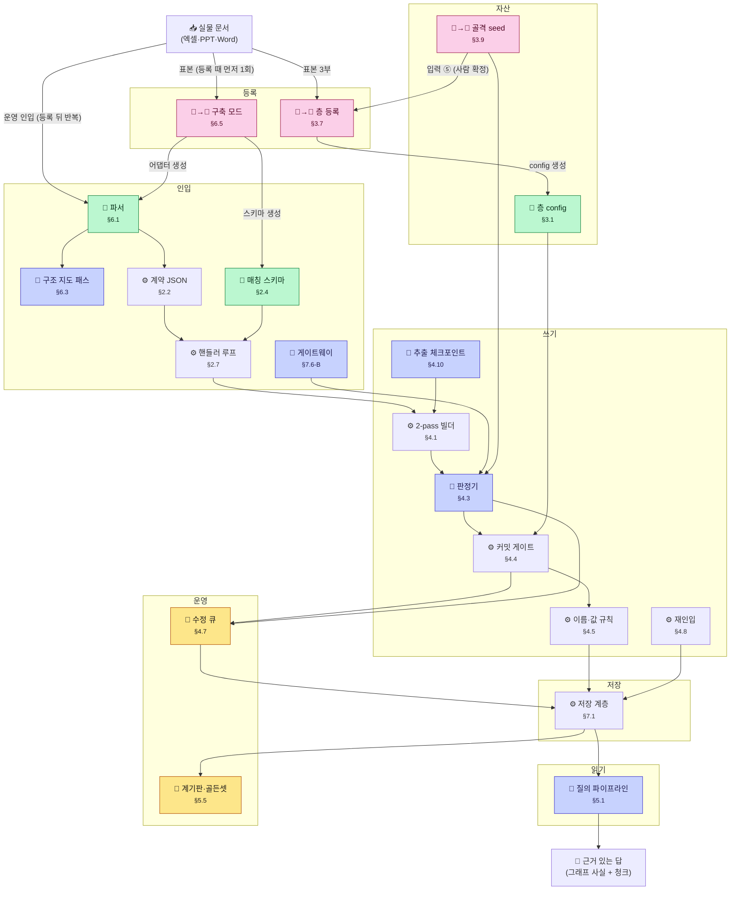
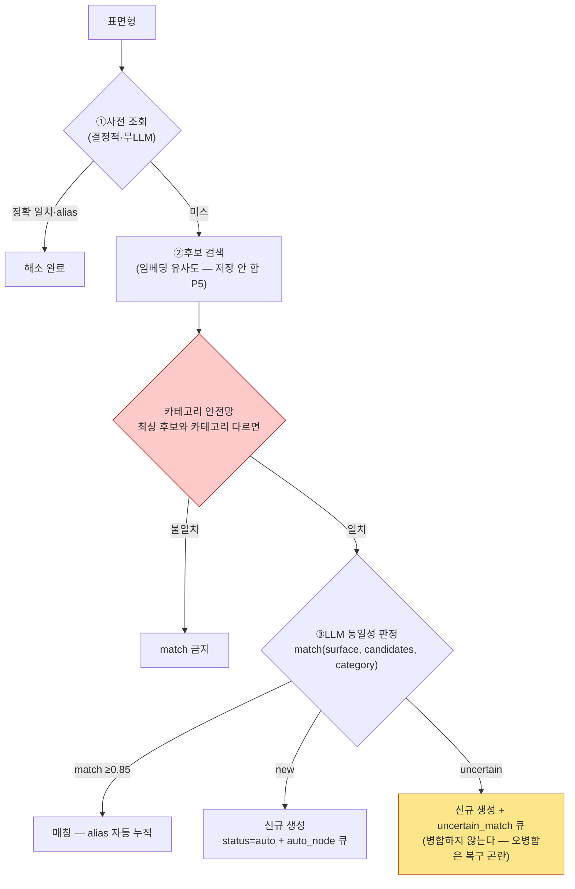
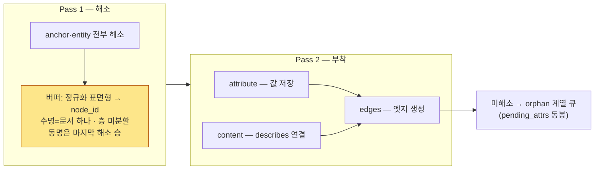
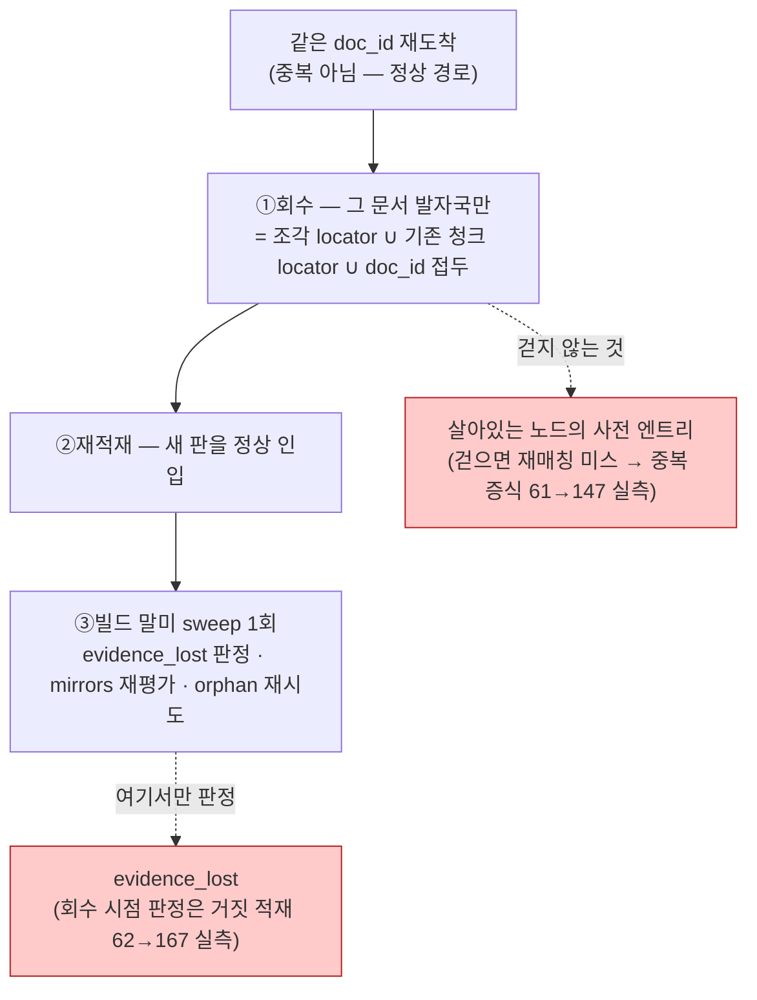
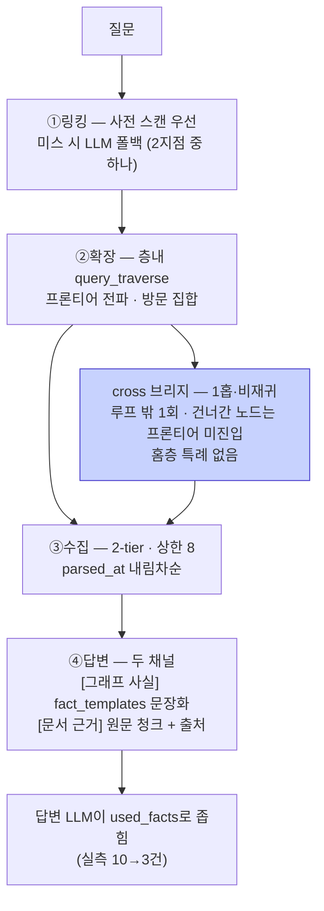

# 구조 설명서 — 지도 한 장 + 부품 카드 20장 + 로직 도해 4곳

> **무엇인가**: 정제본 401KB의 **입구**다. 「지금 어느 부품을 보고 있고, 상세는 어디로 들어가는가」를 대는 것이 전부다.
> **명세를 대신하지 않는다** — 판단이 갈리면 **명세가 이긴다.**
> **자동 생성**: `회귀스위트/추출_구조.py`. 좌표와 조항 참조는 **매 실행 검증**하고 깨지면 exit 1을 낸다.

## 자산의 두 축 — 먼저 이것부터

```
층 축 — 층마다 1벌                    doc_type 축 — 문서 종류마다 1쌍
├ layers/{층}/config.json            ├ adapters/{doc_type}.py   (파싱 어댑터)
└ layers/{층}/skeleton.json          └ schemas/{doc_type}.json  (매칭 스키마 — role 번역표)
```

**LLM이 코드·자산을 만드는 경로는 둘이다** — 지도에서 🤖→👤 로 표시된 부품:

| 경로 | 만드는 것 | 도구 |
|---|---|---|
| **구축 모드** (§6.5~6.7) | 어댑터+매칭 스키마 쌍 — **doc_type마다** | `kit/` 6종 실물 (생성프롬프트 v0.4·하네스·검수 뷰) — 표본 넣고 승인 1회 |
| **층 등록** (§3.7) | 층 config + 골격 seed — **층마다** | 골격 가이드 + config 가이드의 초안 절차 |

## 한 장 지도

> 👤 사람 · 🤖 LLM(런타임) · **🤖→👤 생성은 LLM, 확정은 사람** · 📄 자산 · ⚙ 코드

**읽는 법 — 실물 문서는 두 번 들어간다:**

1. **등록 (먼저 1회)** — 같은 실물 문서가 **표본**으로 구축 모드에 들어가 **어댑터(→파서)와 매칭 스키마**가 생긴다. 새 층이면 층 등록이 표본 3부 + 사람이 확정한 골격 seed를 받아 **층 config**를 만든다.
2. **운영 인입 (등록 뒤 반복)** — 등록이 끝난 doc_type의 문서는 파서→계약 JSON→인입 흐름을 탄다. 등록은 doc_type당 1회, 인입은 문서마다다.



## 단계가 뜻하는 것

- **등록** — 새 문서 종류·새 층을 시스템에 알린다 (구축 모드 · 운영과 분리된 별도 세션)
- **자산** — 사람이 확정해 심는 것. 코드가 아니라 데이터다
- **인입** — 문서가 계약 JSON이 되기까지
- **쓰기** — 계약 JSON이 그래프가 되기까지
- **저장** — 그래프·청크·사전·큐가 파일로 앉는 자리
- **읽기** — 질문이 근거 있는 답이 되기까지
- **운영** — 사람이 자기 리듬으로 처리하는 것


## 등록 — 새 문서 종류·새 층을 시스템에 알린다 (구축 모드 · 운영과 분리된 별도 세션)

### 🤖→👤 구축 모드
> 표본 관찰→어댑터·스키마 생성→검수→승인 1회 등재

| | |
|---|---|
| **받는 것** | 입력 패키지 — 사람 4(표본·이름·층 지정·힌트) + 시스템 5 |
| **내는 것** | adapters/{doc_type}.py · schemas/{doc_type}.json · 승인 기록 |
| **어기면** | 확정본을 review/에 남기면 그 디렉터리는 버전 미추적이라 재생성 시 승인된 어댑터가 함께 사라진다 |
| **사람이 할 일** | 표본 제공 · 검수 뷰 승인 1회(무수정 자동 통과 금지) · 재생성 중단 판단 |
| **명세** | 문서 6 파서와구축모드 §6.5 · §6.6 · §6.7 · 조항 `A13` · `I6` · `L3` · `L4` |
| **실물** | `layers/{층}/skeleton.json` · `schemas/{doc_type}.json` |
| **크기** | 14KB · 금지 20개 |

**⚠ 함정** — mirrors를 매칭 스키마 edges에 선언하는 것 — 하네스 ④도 6지선다도 거르지 못한다(실측)

### 🤖→👤 층 등록
> 새 층을 6단계로 세워 config-only로 등재한다

| | |
|---|---|
| **받는 것** | 표본 3부 이상 · 층 설명 4항목 · 골격 형태 제안 · seed 초안(사람) |
| **내는 것** | layers/{층}/config.json·skeleton.json(seed) + 층 등록부 등재 |
| **어기면** | 카테고리 제안을 structural_proposal 큐에 실으면 승인 한 번이 config.categories 한 줄이 되어 3테스트가 우회된다 |
| **사람이 할 일** | 골격 seed 소유(LLM 산출 아님) · 3테스트 판정 확정 · 승인 1회 |
| **명세** | 문서 3 구조 §3.7 · 조항 `L3` · `L4` |
| **크기** | 7KB · 금지 8개 |

**⚠ 함정** — 등록 커밋에 다른 작업을 섞는 것 — git diff core/ 공백의 config-only 증명이 커밋 1회로 성립하지 않는다


## 자산 — 사람이 확정해 심는 것. 코드가 아니라 데이터다

### 📄 층 config
> 층의 여섯 칸을 값으로 내려 core가 읽는 문법 키로 고정한다

| | |
|---|---|
| **받는 것** | 층 등록 세션이 확정한 카테고리·정의문·관계·프롬프트 |
| **내는 것** | layers/{층}/config.json — 문법 키 19종 (+ schemas/*.json) |
| **어기면** | config로 표현 못 할 절차를 층별 코드로 우회하면 git diff core/ 가 비지 않아 「층 추가 = config 추가」 판정이 성립하지 않는다 |
| **사람이 할 일** | 카테고리·정의문 확정(LLM은 초안까지) · 승인은 층 등록(3.7)에서 1회 |
| **명세** | 문서 3 구조 §3.1 · §3.3 · 조항 — |
| **크기** | 6KB · 금지 6개 |

**⚠ 함정** — 19종 일람이 닫는 것은 core가 읽는 「문법 키」다 — `_` 접두 주석 키는 일람 밖이고 loader가 무시한다. 값은 자산 파일이 정본.

### 🤖→👤 골격 seed
> 사람이 트리로 심는 좌표 1벌 — 중첩은 구조, 배열 순서는 흐름

| | |
|---|---|
| **받는 것** | 사람이 적은 seed 트리 + 극성 마커(`::`·@split·@unordered·@noflow) |
| **내는 것** | part_of·precedes 엣지 · tier 파생 · 좌표 태깅 닫힌 목록·auto alias |
| **어기면** | 순서를 구조로 취급하면 극성 형제를 나열하는 순간 거짓 순서가 박히고, 층마다 사본을 두면 노드 유일성(P4)이 깨지며 골격 개정이 N배가 된다 |
| **사람이 할 일** | seed 트리·극성 패턴 3종 선택·보증 표기 ALIASES까지 — tier는 적지 않는다 |
| **명세** | 문서 3 구조 §3.9 · §3.6 · 조항 `A2` · `P2` · `P4` · `B1` |
| **크기** | 18KB · 금지 23개 |

**⚠ 함정** — alias는 정확 일치만 — 포함 규칙을 걸면 「cathode 노칭 프레스」가 무극성 노드에 흡수된다(포함은 canonical에만)


## 인입 — 문서가 계약 JSON이 되기까지

### 📄 파서
> 사내 실행 프로그램 — 원본 문서를 계약 JSON으로만 내보낸다

| | |
|---|---|
| **받는 것** | 사내 원본(xlsx·pptx·Word·PDF) + 골격 닫힌 목록 스냅샷 |
| **내는 것** | 계약 JSON(봉투·조각공통·payload) — 위반 시 문서 통째 미인입 |
| **어기면** | 어댑터가 순수 함수를 벗어나 LLM을 부르면 같은 입력이 다른 출력을 내, 운영의 결정성과 리허설이 성립하지 않는다 |
| **사람이 할 일** | doc_type 지정(투입 경로)·후보 1클릭 확정 · adapter_version 수동 증가 |
| **명세** | 문서 6 파서와구축모드 §6.1 · §6.2 · §6.4 · 조항 `P7` |
| **크기** | 11KB · 금지 17개 |

**⚠ 함정** — validator의 「좌표 존재」는 필드 존재이지 목록 대조가 아니다 — 대조를 문서 실패로 걸자 한 행 때문에 문서 전체가 미인입됐다(실측)

### 🤖 구조 지도 패스
> 구조 가변 prose — LLM은 지도만, 분할은 결정적 코드

| | |
|---|---|
| **받는 것** | reader 원시 추출물 + 어댑터 expects의 힌트(프라이어·강제 아님) |
| **내는 것** | 구조 지도 {행/단락→헤딩·레벨·제목} → extract/struct_maps/{doc_id}.json |
| **어기면** | 보존 자리를 클린 범위(data/·extract/) 밖에 두면 클린 2회 동일 그래프 검증이 1회차 지도를 물고 거짓 통과한다 |
| **사람이 할 일** | 운영 무인 — 지도 타당성 검사 실패 시 hierarchy_unresolved 큐에서만 |
| **명세** | 문서 6 파서와구축모드 §6.3 · 조항 `C13` · `I6` · `P7` |
| **실물** | `extract/struct_maps/{doc_id}.json` · `mock/struct_maps/` |
| **크기** | 4KB · 금지 5개 |

**⚠ 함정** — USE_MOCK=1은 지도가 고정 파일이라 보존 없이도 멱등성이 통과한다 — mock만으로는 이 결함이 드러나지 않는다

### ⚙ 계약 JSON
> 파서와 에이전트가 만나는 유일한 접점 — 3층 JSON

| | |
|---|---|
| **받는 것** | 파서 tagger 단의 정규 조각 + 골격 닫힌 목록 스냅샷·skeleton_version |
| **내는 것** | 봉투·조각공통·payload 3층 JSON — records[] 또는 chunks[] |
| **어기면** | doc_id가 문서마다 흔들리면 재인입 자체가 성립하지 않고, section 이음이 갈리면 같은 문서가 다른 chunk_id를 낳는다 |
| **사람이 할 일** | 어댑터 개정 시 adapter_version 수동 증가(봉투 1회) |
| **명세** | 문서 2 계약 §2.2 · §2.3 · 조항 `L1` · `P4` |
| **크기** | 10KB · 금지 16개 |

**⚠ 함정** — chunk_id·record_id는 파서 출력에 없다 — 정본 id는 에이전트가 계산한다(멱등성 근거를 사내 파서 구현에 위임하지 않는다)

### 📄 매칭 스키마
> 한 doc_type의 필드에 role을 배정하고 엣지를 선언하는 한 파일

| | |
|---|---|
| **받는 것** | 등록 세션의 표본 관찰(어댑터와 연쇄 산출) · 런타임은 doc_type 문자열 조회 |
| **내는 것** | schemas/{doc_type}.json — 헤더+fields(role 배정)+edges 선언 |
| **어기면** | attr_name이 저장 키를 고정하지 않으면 doc_type마다 다른 키로 값이 쌓여 값 병합·spec_conflict 판정이 대상 키를 못 찾는다 |
| **사람이 할 일** | UNMAPPABLE 판정(L3/L4로 넘김) · 등록 세션 검수·승인 1회 |
| **명세** | 문서 2 계약 §2.4 · §2.5 · 조항 `L1` · `L3` · `L4` · `P2` |
| **실물** | `schemas/pfmea.json` · `schemas/{doc_type}.json` |
| **크기** | 20KB · 금지 22개 |

**⚠ 함정** — 본문 PFMEA 표는 발췌 — 정본은 자산 schemas/pfmea.json. 선언 순서가 record_id의 join 순서라 사본은 다른 id를 낸다(실측)

### ⚙ 핸들러 루프
> role만 보고 분기하는 순회기 — 코드에 필드명이 없다

| | |
|---|---|
| **받는 것** | 계약 JSON 레코드 + 매칭 스키마(fields·edges) + ctx 6종 |
| **내는 것** | 핸들러 반환 3형태(resolved_id|value|None) + 엣지 후처리 + 큐 항목 |
| **어기면** | 반환 3형태가 없으면 edges 후처리가 미해소를 판별 못 해, optional 생략과 진짜 미해소가 뒤섞이고 미해소가 큐 없이 사라진다 |
| **사람이 할 일** | duplicate_doc_hold 2택 — ㉠폐기·종결 / ㉡--allow-duplicate로 인입 |
| **명세** | 문서 2 계약 §2.7 · 조항 `A13` · `P7` |
| **크기** | 8KB · 금지 13개 |

**⚠ 함정** — 리스트 값 방어의 대상은 entity·anchor뿐 — attribute는 배열도 통째로 한 값이라 방어 대상이 아니다(사전을 안 타므로)

### 🤖 게이트웨이
> LLM 지점 9종을 mock/실호출 한 쌍으로 묶는다

| | |
|---|---|
| **받는 것** | 환경변수 USE_MOCK·LLM_GATEWAY_URL·LLM_API_KEY·CHAT_MODEL |
| **내는 것** | core/llm.py(호출·JSON 파싱·재시도) · core/embeddings.py |
| **어기면** | 실호출 경로가 빈 채 통과하면 MOCK 요약 자리표시자가 청크 텍스트가 되어 답변 근거로 되돌아온다 — 조용한 오염 |
| **사람이 할 일** | 프롬프트 템플릿 파일 확정·버전 관리 · [사내 확인] 게이트웨이 제약 |
| **명세** | 문서 7 구현규격과검증 §7.6-B · 조항 `B12` |
| **실물** | `core/embeddings.py` · `core/llm.py` |
| **크기** | 3KB · 금지 7개 |

**⚠ 함정** — 주석으로 훅을 표시하고 이음매로 삼는 것 — 자동 점검이 주석을 세어 빈 지점을 구현된 것으로 보고한다


## 쓰기 — 계약 JSON이 그래프가 되기까지

### ⚙ 2-pass 빌더
> 문서 하나를 해소(Pass1) → 부착(Pass2) 두 통과로 처리한다

| | |
|---|---|
| **받는 것** | 계약 JSON(정형) · 계약 JSON + 추출 후보 JSON(비정형) |
| **내는 것** | 노드·엣지·attribute·describes + 문서 해소 버퍼(표면형→node_id) |
| **어기면** | 버퍼의 스코프·수명·승자 규칙이 없으면 같은 문서의 걸침 엣지가 구현마다 다른 노드에 착지한다 — 그래프에 실제로 다른 엣지가 남는다 |
| **사람이 할 일** | 없음 |
| **명세** | 문서 4 쓰기절차 §4.1 · §4.2 · 조항 — |
| **크기** | 3KB · 금지 5개 |

**⚠ 함정** — 비정형 Pass 2의 순회 단위는 레코드가 아니라 청크다 — prose의 fields는 {}라 핸들러 루프로는 describes가 0건이 된다

### 🤖 판정기
> 「기존의 무엇과 같은가」를 3분기로 답하는 단일 진입점

| | |
|---|---|
| **받는 것** | mention + 후보(canonical·aliases·부착 위치·category) |
| **내는 것** | {match|new|uncertain, matched_id, confidence} + alias 누적·큐 |
| **어기면** | 후보에서 부착 위치가 빠지면 LLM이 다른 공정에 속한 동명 관리항목을 「같은 개념」으로 답하고, 안전망이 판정 전 필터에서 사후 필터로 밀린다 |
| **사람이 할 일** | 판정 자체엔 없음 — 불확실은 uncertain_match 큐에서 사람이 판정 |
| **명세** | 문서 4 쓰기절차 §4.3 · 조항 `P4` · `P5` · `P6` · `P7` |
| **실물** | `core/matcher.py` |
| **크기** | 3KB · 금지 2개 |

**⚠ 함정** — 카테고리 불일치는 유사도보다 세다 — 최상 후보의 카테고리가 다르면 match 금지(「노칭」Process ↔ 「노칭 정밀도」Property)

### ⚙ 커밋 게이트
> 엣지 커밋 전 (출발·관계·도착) 삼항을 패턴표와 대조한다

| | |
|---|---|
| **받는 것** | 경로 ②edges·③추출후보·④자동규칙의 엣지 + 출발·도착 그래프(①seed 비경유) |
| **내는 것** | 커밋된 엣지 / 방향 큐 2종 / gate_rejects 거부 기록(큐 아님) |
| **어기면** | 방향을 자동으로 뒤집으면 인과 그래프에 틀린 사실이 확신 있게 기록되고, 패턴표에 없는 관계는 그 doc_type의 엣지가 한 건도 생기지 않는다 |
| **사람이 할 일** | direction_conflict·direction_unverifiable 큐에서 방향 확정 후 커밋 |
| **명세** | 문서 4 쓰기절차 §4.4 · 조항 `I5` · `P4` · `P7` |
| **실물** | `data/defects.log` |
| **크기** | 14KB · 금지 28개 |

**⚠ 함정** — 금지 단위는 이름이 아니라 삼항 — 골격 삼항은 패턴표에서 빼되 Unit part_of Process는 넣는다(이름 단위로 지우면 골격 부착이 죽는다·D-52)

### ⚙ 이름·값 규칙
> 이름은 극성·스코프로 정하고, 값은 노드 필드에 맥락별로 보존한다

| | |
|---|---|
| **받는 것** | 판정된 표면형·부착 노드, 층 config의 polarity·스코프 선언, 레코드 값 항목 |
| **내는 것** | 극성 결합된 canonical·alias, 맥락형 값 항목, spec_conflict 큐 |
| **어기면** | 스코프가 갈리면 CP와 PFMEA가 같은 관리항목에 다른 키를 만들어 병합되지 않고, 극성 결합을 빠뜨리면 cathode·anode가 한 노드로 섞인다. |
| **사람이 할 일** | 층 config에 polarity·스코프 선언, spec_conflict 큐의 값 충돌 판단 |
| **명세** | 문서 4 쓰기절차 §4.5 · §4.6 · 조항 `P4` · `L1` · `P7` |
| **크기** | 6KB · 금지 10개 |

**⚠ 함정** — 이중 결합 방지는 Property 한정이다 — Unit은 스코프가 없어 생략하면 이름이 같고 극성만 다른 노드 2개가 공존한다(실측).

### ⚙ 재인입
> 같은 doc_id의 개정본이 오면 그 문서 몫만 걷어내고 다시 넣는다

| | |
|---|---|
| **받는 것** | 같은 doc_id의 개정본 계약 JSON과 현재 그래프·사전·큐 |
| **내는 것** | 그 문서 몫만 교체된 그래프, 재평가된 큐, 빌드 말미 sweep 결과 |
| **어기면** | 살아있는 노드의 사전 엔트리까지 걷으면 재매칭이 사전 미스가 되어 중복 노드가 증식한다(실측: 재인입 두 번에 노드 61→147). |
| **사람이 할 일** | 없음 — 노드 제거는 I4, 엣지 삭제는 사람 도구 몫(재인입은 후보만 낸다) |
| **명세** | 문서 4 쓰기절차 §4.8 · 조항 `I4` |
| **크기** | 4KB · 금지 3개 |

**⚠ 함정** — evidence_lost 판정을 회수 시점에 하면 재적재될 항목까지 거짓 적재된다 — 자리는 빌드 말미 sweep 1회뿐(실측 62→167).

### 🤖 추출 체크포인트
> 추출의 산출물이자 구축의 입력인 계약 B — 표면형만 담는다

| | |
|---|---|
| **받는 것** | 청크, 지시문 템플릿, 층 config 어휘, 골격 스냅샷(seed)의 부착 후보 |
| **내는 것** | 표면형 후보 JSON(3버전 기록), 실패 청크는 data/defects.log |
| **어기면** | 주입 어휘를 사전·그래프에서 읽으면 문서 순서에 따라 추출 경계가 달라져 멱등성이 깨진다(실측: 정순 66·역순 65 노드로 갈렸다). |
| **사람이 할 일** | 지시문 템플릿(prompt_version)을 사람이 확정·관리. 추출 자체는 개입 없음 |
| **명세** | 문서 4 쓰기절차 §4.10 · 조항 `P1` · `B1` · `G7` · `P7` |
| **실물** | `data/defects.log` · `layers/{층}/config.json` |
| **크기** | 7KB · 금지 13개 |

**⚠ 함정** — attach_to에 카테고리가 없으면 후보 검색이 전 카테고리를 훑고 선언 순서가 답을 정한다(실측: '정밀 노칭 프레스'가 두 카테고리에 0.95)


## 저장 — 그래프·청크·사전·큐가 파일로 앉는 자리

### ⚙ 저장 계층
> 두 축 id 산식과 저장 형태를 소유하고 관문으로만 연다

| | |
|---|---|
| **받는 것** | 인입·쓰기 단계의 노드·엣지·청크·큐 항목 호출 |
| **내는 것** | data/ 진실 4종 — graph·chunks·dictionary·review_queue.json |
| **어기면** | 락·tmp+rename이 없으면 build가 죽을 때 graph.json이 반쯤 남고, data/는 재생성 대상이 아니라 진실이 복구 불가로 유실된다 |
| **사람이 할 일** | data/ 백업(진실 장애만이 백업 문제) · 부분 저장은 그 doc_id 재인입 |
| **명세** | 문서 7 구현규격과검증 §7.1 · §7.2 · 조항 `B6` · `P4` · `D8` · `G2` |
| **실물** | `layers/{층}/config.json` · `mock/extract_hints/{doc_id}.json` · `mock/struct_maps/{doc_id}.json` · `core/dictionary.py` |
| **크기** | 24KB · 금지 35개 |

**⚠ 함정** — table 청크 id를 해시로 발급하는 것 — 산식은 {record_id}-{필드명} 파생이라 재인입 회수가 옛 청크를 못 찾는다


## 읽기 — 질문이 근거 있는 답이 되기까지

### 🤖 질의 파이프라인
> 코드가 연결성으로 근거를 고르고 LLM은 그 근거로만 답한다

| | |
|---|---|
| **받는 것** | 질문 표기, 전 층 GraphStore 묶음, config의 traverse·fact_templates |
| **내는 것** | [그래프 사실]·[문서 근거] 두 채널과 출처 붙은 답변, 링킹 미스 로그 |
| **어기면** | 브리지를 프론티어 루프에 넣으면 1홉이 층 전체로 번지고, 두 채널을 한 덩어리로 붙이면 청크의 옛 서술이 그래프 사실을 덮는다 |
| **사람이 할 일** | 질문 입력뿐 — 질의는 읽기 전용이라 사람도 사전을 못 바꾼다 |
| **명세** | 문서 5 읽기절차 §5.1 · §5.2 · §5.3 · 조항 `P6` · `B6` · `K9` · `B1` |
| **크기** | 14KB · 금지 15개 |

**⚠ 함정** — `recursive:false`는 같은 관계를 연달아 재추적하지 않는다는 뜻이다 — 다른 관계로 도달한 노드에는 적용되고, 확장은 홉 상한으로 자르지 않는다


## 운영 — 사람이 자기 리듬으로 처리하는 것

### 👤 수정 큐
> 자동 커밋 뒤 남은 일을 닫힌 20종 큐로 싣고 I축으로 고친다

| | |
|---|---|
| **받는 것** | 구축이 처리 못 한 것, 골격 개정 제안, 사람의 I축 명령(--actor 필수) |
| **내는 것** | {kind,reason,doc_id,payload,created} 항목, ops_log, seed diff |
| **어기면** | 생존자를 '앞선 id'만으로 정하면 auto가 seed를 흡수해 골격이 데이터 조작으로 훼손되고, 조용히 버린 실패는 어느 목록에도 남지 않는다 |
| **사람이 할 일** | 큐 항목 검토 확정(auto→confirmed), I3 배분표·I4 판정, 골격 제안 승인 |
| **명세** | 문서 4 쓰기절차 §4.7 · §4.9 · 조항 `A5` · `P4` · `P2` · `P7` |
| **크기** | 19KB · 금지 20개 |

**⚠ 함정** — '옛 큐 회수'는 해소된 항목을 내리라는 뜻이다 — 문서 단위 일괄 회수는 재검출되지 않는 auto_node 목록까지 지운다(실측 61→11)

### 👤 계기판·골든셋
> 지표 8종이 이연 기능의 도입 여부를 판정한다

| | |
|---|---|
| **받는 것** | 골든셋 문항(기준 120)·link_miss.log·chunk_truncated.log |
| **내는 것** | 지표 8종 값 + BM-25 대조군 점수 — 별도 호출로만 계산 |
| **어기면** | 측정 중 link_miss를 끄지 않으면 다음 측정이 자기 흔적을 세고, 대조군 없는 점수는 인상이라 도입 판정이 서지 않는다 |
| **사람이 할 일** | 실물 골든셋 문항 제작(사내 진입 후) · 측정으로 도입 판정 |
| **명세** | 문서 5 읽기절차 §5.5 · 조항 `A8` · `P7` · `N5` · `P6` |
| **크기** | 4KB · 금지 4개 |

**⚠ 함정** — mock 계기판을 품질 측정으로 읽는 것 — 골든셋 전 recall류 분모는 12문항이라 메커니즘 검증일 뿐이다


## 로직 도해 (2층) — 실측 사고가 났던 부품 4곳

> **왜 이 넷인가**: 전부 구현이 실제로 갈렸거나 조용히 틀렸던 자리다. 그림은 **명세의 파생물**이다 — 판단이 갈리면 명세가 이긴다. 각 도해에 명세 좌표와 실측 사고를 단다.

### 1. 판정 3분기 — "같은 개념인가" (§4.3)

**실측 사고**: 안전망이 판정 전 필터가 아니라 사후 필터로 밀려 「노칭」(Process)과 「노칭 정밀도」(Property)가 유사도로 붙을 뻔했다.



**핵심 규칙**: 임계 0.85 단일 · 불확실은 **병합이 아니라 신규**(되돌리기 쉬운 쪽으로 틀린다) · 단일 진입점 `core/matcher.py` — 재사용 3지점(attach_to 해소·orphan 재시도·I2 병합)이 전부 이 함수다. **anchor는 이 파이프라인을 타지 않는다** — 사전까지만(B10 판정: 골격은 추론으로 끌어당기지 않는다).

### 2. 2-pass — 문서 하나의 처리 (§4.2)

**실측 사고**: 버퍼의 스코프·수명이 미정이라 같은 문서의 걸침 엣지가 구현마다 다른 노드에 착지할 뻔했다.



**핵심 규칙**: 부착은 해소가 끝난 뒤에만 — 문서 안 전방 참조가 이래서 된다 · **비정형 Pass 2의 순회 단위는 레코드가 아니라 청크** — prose의 fields는 `{}`라 핸들러 루프로는 describes가 0건이 된다 · 2-pass는 **문서 단위**다(코퍼스 단위 아님 — C14).

### 3. 재인입 회수 — 개정본이 오면 (§4.8)

**실측 사고 둘**: ①사전 엔트리까지 걷어 재매칭이 전부 미스 → 노드 61→147 중복 증식 ②evidence_lost를 회수 시점에 판정 → 재적재될 항목까지 거짓 적재 62→167.



**핵심 규칙**: 회수 대상은 **문서 발자국**(provenance 항목)이지 노드가 아니다 — 노드 제거는 I4(사람)의 몫 · 멱등성 판정은 **클린 2회 동일 그래프**(그래프 바이트 동일 · 큐 집합 동일).

### 4. 질의 4단 — 질문이 답이 되기까지 (§5.1)

**실측 사고**: `recursive:false`로 도달한 노드를 프론티어에서 통째로 빼 2홉이 끊겼다 — **회귀 526건 전부 초록인 채로.**



**핵심 규칙**: 질의는 **읽기 전용**(P6) — 사전도 못 바꾼다 · `recursive:false` = "같은 관계 연속 재추적 금지"일 뿐, **다른 관계로 도달한 노드에는 적용**된다(공정→설비→인자 2홉의 근거) · 근거 밖 답변은 [일반지식] 표시.
