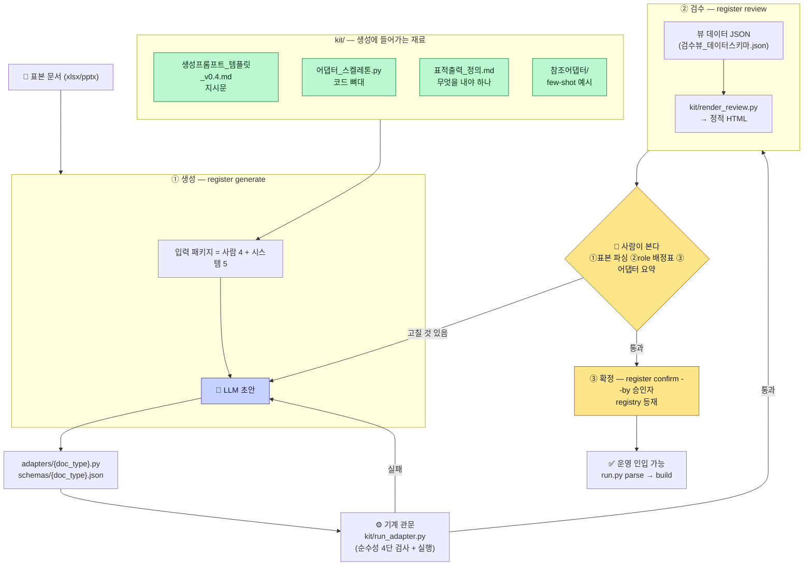

# 구축 모드 흐름 — 어댑터·매칭 스키마가 만들어지는 순서

> **왜 이 문서가 있나**: 킷 6종이 각각 무엇이고 어떤 순서로 도는지가 **한곳에 없었다.** 명세는 §6.5(입력 패키지)·§6.6(검수 뷰)·§6.7(킷 목록)에 나뉘어 있고 흐름도가 없다. 이 문서는 **레포 실물(`cli/register.py`·`kit/`)을 읽어 뽑은 것**이며, 판단이 갈리면 명세가 이긴다.

## 한 장 흐름



## 입력 패키지 — 사람 4 + 시스템 5 (§6.5)

**이 수가 명세이고 회귀가 센다** — 늘리거나 줄이지 않는다.

| | 항목 | 어디서 오나 |
|---|---|---|
| **사람 1** | 표본 문서 | 당신이 고른다 |
| **사람 2** | doc_type 이름 | 당신이 정한다 (중복이면 거부) |
| **사람 3** | 층 지정 | 존재하는 층이어야 한다 |
| **사람 4** | 힌트 (자유 텍스트) | 선택 — *"3행이 헤더다"* 같은 것 |
| **시스템 1** | `reader_head` — 표본 앞 12행 원시 추출 | `parser/reader.py` |
| **시스템 2** | `skeleton_closed_list` — 골격 canonical+alias+tier | **스냅샷**(`data/skeleton_closed_list.json`)에서. **`layers/{층}/skeleton.json`을 읽지 않는다** — 인라인 층에는 그 파일이 없다 |
| **시스템 3** | `layer_vocabulary` — 층 이름·전 층 목록·카테고리·관계·패턴 | `layers/{층}/config.json` |
| **시스템 4** | `blocks` — 공용 블록 | `schemas/blocks.json` |
| **시스템 5** | `adapter_skeleton` — 코드 뼈대 경로 | `kit/어댑터_스켈레톤.py` |

## 킷 6종이 각각 하는 일

| # | 파일 | 언제 | 무엇 |
|---|---|---|---|
| 1 | `생성프롬프트_템플릿_v0.4.md` | ①생성 | **LLM 지시문.** payload_kind 분기·header_labels 필수·UNMAPPABLE 회피·골격 목록 주입 자리 |
| 2 | `어댑터_스켈레톤.py` | ①생성 | 어댑터 코드의 **형태**(ADAPTER 선언 1 + extract 함수 1) |
| 3 | `표적출력_정의.md` | ①생성 | **무엇을 내야 하나** — 계약 JSON의 목표 형태 |
| 4 | `참조어댑터/` | ①생성 | **few-shot 예시.** 어댑터 코드 + 매칭 스키마 쌍. *"많을수록 좋은 게 아니라 각각이 다른 것을 보여줘야"* |
| 5 | `run_adapter.py` | ①→② 사이 | **기계 관문.** 순수성 4단 검사(상태·네트워크·LLM 금지) + 표본 실행. **사람보다 먼저 거른다** |
| 6 | `render_review.py` + `검수뷰_데이터스키마.json` | ②검수 | 뷰 데이터 JSON → **정적 HTML**. 렌더러 교체 가능 |

**5번이 핵심 장치다** — 기계 관문이 없으면 *"사람이 문법 오류를 읽는 자리"*로 내려앉는다(§3.7 규약 5).

## 명령 셋

```bash
python run.py register generate <doc_type> <층> <표본...> [힌트]   # ①
python run.py register review   <doc_type> [지시]                  # ② 재생성 루프 (상한 없음)
python run.py register confirm  <doc_type> --by <승인자>            # ③ 승인 1회
```

- **재생성 루프는 상한이 없다.** 이력은 기록된다. **승인은 마지막 1회.**
- **"무수정 = 자동 통과"는 금지다**(M4) — 승인자 없이는 등재하지 않는다.
- 확정 산출물은 `adapters/`·`schemas/`에 앉고 `registry`에 등재된다. **`review/`에 남기지 않는다** — 그 디렉터리는 버전 미추적이라 재생성 시 승인본이 사라진다.

## 지금 있는 어댑터 (2A 시점)

| 위치 | 무엇 |
|---|---|
| `parser/adapters/basic_ppt.py` | **코어 제공 기본 어댑터** — 분할 자명 계열(PPT). 등록 시 그대로 붙인다 |
| `tests/fixtures/adapters/cp.py`·`pfmea.py` | **mock 픽스처**(xlsx). 테스트 전용 |
| `kit/참조어댑터/` | few-shot 사본 |
| **`adapters/`** | **비어 있는 것이 정상** — 사내 실물이 여기 앉는다 |

**사내 xlsx용 어댑터는 아직 없다** — `register generate`로 만드는 것이 2B 4단계다.
