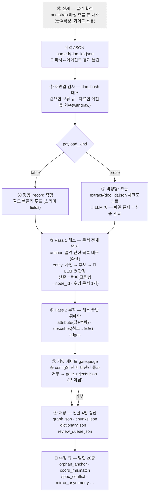

# 쓰기 절차 설명서 — 문서가 그래프가 되기까지

> **독자**: 운영자(사용자 본인). 정본은 문서 4(쓰기 절차)·문서 2(계약)이고 이 문서는 **설명서**다 — 갈리면 정본이 이긴다.
> **범위**: 파싱이 끝난 뒤부터다. 계약 JSON이 이미 있고(`parsed/{doc_id}.json`), 그것이 그래프·청크·사전·큐가 되는 길을 따라간다. 파싱·등록은 `구축모드_흐름.md` 소유.
> **레포 반입**: 다음 회차에 `구축모드_흐름.md`와 함께 `docs/가이드/`로 간다.

## 0. 한 장 지도

핵심 한 줄: **쓰기는 "행을 넣는 것"이 아니라 "행이 가리키는 것을 먼저 판정하는 것"이다.** 판정(Pass 1)이 끝나야 부착(Pass 2)이 시작되고, 부착도 게이트를 통과해야 저장된다. 판정이 안 서는 것은 버리지 않고 **전부 큐로 간다**.

## ⓪ 전제 — 골격이 먼저 서 있어야 한다

모든 좌표 판정(anchor)은 골격 닫힌 목록과 대조한다. 골격이 틀리면 뒤가 전부 어긋난다.

- 골격을 새로 만들거나 고쳤으면 **반드시** `python3 run.py bootstrap`을 돌리고 화면의 **「파생 대표 흐름 (사람 대조용)」을 눈으로 대조**한다 — 순서가 지어졌는지(무주장이어야 할 것이 화살표로 이어졌는지), 이름이 모호한지가 여기서 드러난다. 절차·양식은 `골격작성_가이드.md` 소유.
- LLM(Copilot 등)으로 seed 초안을 받는 경로에서 이 대조는 **초안 허용의 근거 그 자체**다(문서 3 §3.7 조건 ③) — 건너뛰면 근거가 빈다.

## ① 재인입 검사 — 같은 문서인가, 개정판인가

인입은 문서 대장(`doc_registry.json`)에서 doc_id·doc_hash를 대조한다.

| 상황 | 동작 |
|---|---|
| 처음 보는 문서 | 등록 후 진행 |
| **같은 doc_id·같은 hash** | 보류(duplicate_doc_hold 큐) — 해제는 사람 |
| **같은 doc_id·다른 hash (개정판)** | **이전 몫을 먼저 걷어낸다**(`withdraw`) — 그 문서가 만든 청크·describes·provenance를 회수한 뒤 새로 쓴다. 회수 없이 덮으면 개정이 아니라 중첩이다 (문서 4 §4.8) |

**함정**: 재인입은 상시 상태다 — 사내 문서는 개정된다. "한 번 넣었으니 끝"이 아니라 **개정판을 다시 넣는 것이 정상 운영**이고, 회수→재기입이 그것을 안전하게 만든다.

## ② 갈림 — 정형은 직행, 비정형은 추출을 거친다

- **정형(table)**: record가 이미 구조라 추출 단계가 없다. 매칭 스키마의 `fields`가 정한 role대로 필드 핸들러 루프를 돈다. **LLM 없이 그래프까지 완주하는 경로다.**
- **비정형(prose)**: 청크에서 후보(개체·관계 언급)를 뽑는다 — LLM 지점 ①. 산출은 `extract/{doc_id}.json` **체크포인트**로 남는다.

**함정 (실측)**: **체크포인트는 「파일 존재 = 추출 완료」다.** 있으면 재사용한다 — 화면에 `[인입] CP01: … [추출 체크포인트 재사용]`이 뜨는 것이 그것이다. **프롬프트를 바꿔도 체크포인트가 있으면 재추출하지 않는다** — 재추출하려면 해당 `extract/{doc_id}.json`을 지우고 다시 인입한다.

## ③ Pass 1 해소 — 문서 전체를 먼저, 부착은 그다음

문서의 모든 anchor·entity를 **먼저 전부** 판정해 버퍼(표면형→node_id, 수명 = 문서 1개)에 담는다. 뒤 행이 앞 행의 개체를 가리켜도 되는 이유가 이 분리다.

**anchor (좌표 — Process 등)**: 골격 닫힌 목록과 대조. 결과는 셋뿐이다 —

| 결과 | 무엇 | 화면 실측 |
|---|---|---|
| 일치 | 그 노드에 해소 | — |
| 목록 밖 | 값을 고치지 않고 그대로 → 인입에서 **orphan_anchor 큐** | 큐 적재 로그 |
| 실존하나 관계가 안 맞음 | **coord_mismatch 큐** | `큐 coord_mismatch [CP01] — '스태킹'는 골격에 실존하나 '노칭'의 조상이 아니다` |

**entity (개체 — Property·Failure 등)**: 3단 — ①동의어 사전 히트(무LLM) ②후보 수집 ③LLM 판정(지점 ②). 화면: `②개체 동일성 판정 — '노칭::노칭 정밀도' vs 후보 10`.

**비용의 실제 모양**: LLM 호출은 **행 수가 아니라 고유 표면형 수에 비례한다.** 같은 표면형은 첫 판정 후 사전 히트다 — PFMEA 4천 행에 고장모드 40종이면 판정은 40번 언저리이지 4천 번이 아니다. (좌표 쪽 LLM 보조는 다르다 — 미스 **행마다**다. 그래서 등록 리허설에는 동의 관문이 있다 — B22.)

## ④ Pass 2 부착 — 값·근거·관계

해소가 끝난 뒤에만 돈다.

- **attribute**: 값 + 맥락(context 그룹) 저장. **같은 맥락에 다른 값이면 조용히 덮지 않는다** — 실측: `큐 spec_conflict [CP01] — 스태킹::적층 정렬도의 spec: 같은 맥락에 다른 값`.
- **describes**: 청크→노드 근거 연결. 비정형의 순회 단위는 레코드가 아니라 **청크**다 — 해소된 언급 전부에 대해 걸며, 엣지 성립 여부와 무관하다. 링킹 0건 청크도 버리지 않고 저장된다(`linked: false`).
- **edges**: 관계 생성 — 단, 스스로 저장하지 못하고 다음 단계의 게이트를 지난다.

## ⑤ 커밋 게이트 — 층 config에 없는 관계는 저장되지 않는다

`gate.judge(src_cat, rel, dst_cat)` — 층 config의 `relation_patterns`에 선언된 조합만 통과한다. **거부는 큐가 아니라 `gate_rejects.json`**이다: 큐는 "사람이 판정할 것"이고 게이트 거부는 "선언 밖이라 판정 대상도 아닌 것"의 관측 기록이다.

**함정**: 넣었다고 생각한 관계가 그래프에 없으면 **먼저 gate_rejects.json을 열어 본다.** 어댑터·추출이 틀린 게 아니라 config에 그 관계 패턴이 선언 안 된 경우가 있다 — 그러면 고칠 곳은 코드가 아니라 층 config이고, 그것은 층 개정 절차를 탄다.

## ⑥ 저장과 큐 — 무엇이 남고 어디서 보나

| 산출물 | 무엇 | 보는 법 |
|---|---|---|
| `data/{층}/graph.json` | 노드·엣지 | `show node` · export html |
| `data/chunks.json` | 원문 전량 + describes | 청크 열람 |
| `data/dictionary.json` | 동의어 사전 — **영속 지식.** 판정이 쌓일수록 다음 인입이 싸진다 | 노드 상세의 별칭 |
| `data/review_queue.json` | 닫힌 20종 | kind별 큐 조회 |
| `data/gate_rejects.json` | 게이트 거부 관측 | 직접 열람 |

**큐에 대한 태도 (실측)**: mock 전체 인입에서도 mirror_asymmetry 수십 건이 뜬다 — `'노칭::버 높이'가 anode 쪽에만 있다`. **큐가 쌓이는 것은 고장이 아니라 시스템이 일하는 모양이다.** 조용히 버리지 않는다(G5)의 물리적 형태가 큐다. 실문서 첫 인입에서 orphan_anchor·mirror_asymmetry가 대량으로 뜨면: ①골격 alias 부족(가장 흔함 — 골격 개정) ②문서 표기 문제 ③진짜 신규 개체, 순서로 본다.

## 확인 루틴 — 인입 한 번 하고 눈으로 볼 것 셋

1. `[인입] {doc_id}: record N · chunk M` — 기대한 규모인가 (0이면 스키마 fields나 추출을 의심)
2. `show node`로 표본 노드 하나 — 값·별칭·근거 청크가 달렸는가 (**답의 뒷면 보기**)
3. 큐 조회 — 새로 쌓인 kind와 건수. 특히 orphan_anchor가 예상 밖으로 많으면 골격 alias부터

계기판(`run.py gauges`)은 문서 몇 개 쌓인 뒤의 이야기다 — 첫 실측정이 P7 판정(임계 조정)의 근거가 된다.
