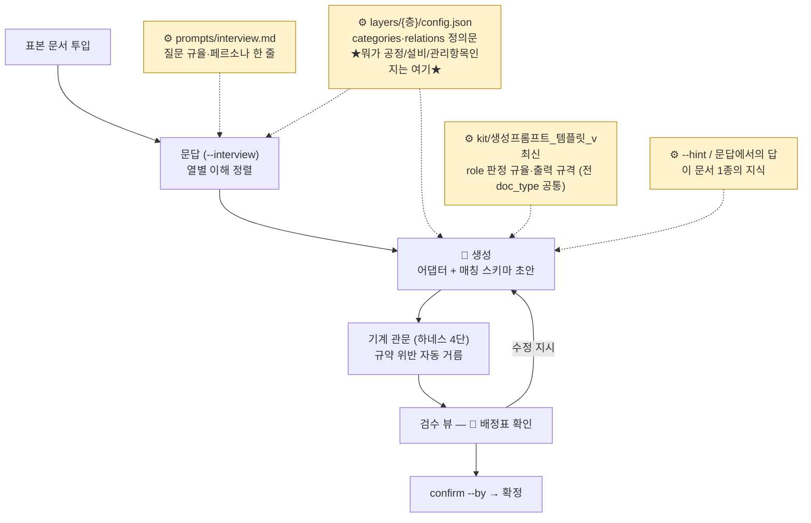
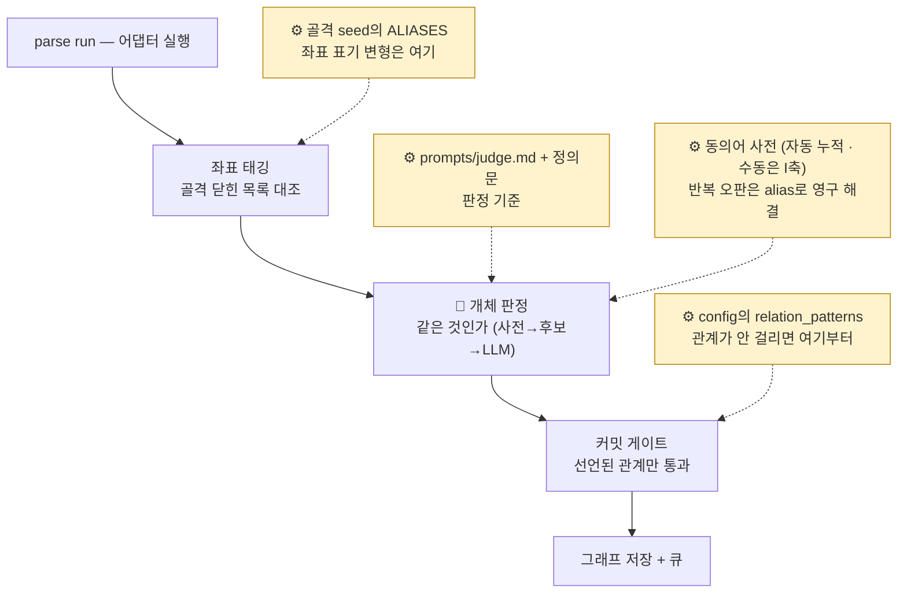
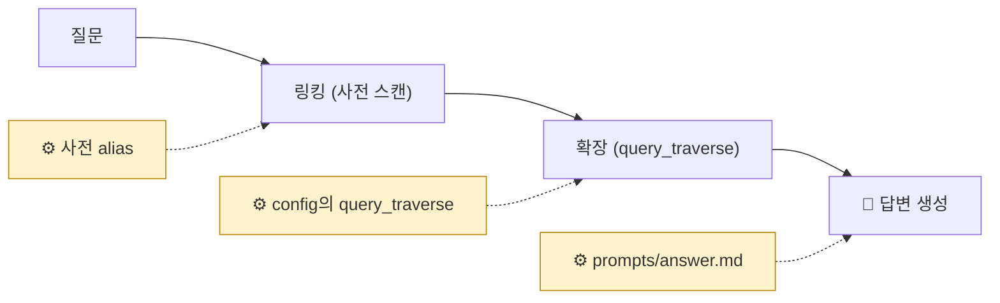

# 조절 지도 — 흐름 위에서, 어느 단계의 어떤 판단을 어느 자산이 만드나

> **독자**: 운영자. LLM의 판단이 아쉬울 때 "흐름의 어디서 잘못됐고, 그 자리를 만드는 자산이 무엇인지"를 찾는 지도다.
> **읽는 법**: 아래 흐름도의 ⚙배지가 **사람이 조절하는 자산**이다. 배지가 꽂힌 단계의 판단만 그 자산이 바꾼다 — 다른 단계는 안 변한다.

## 등록 흐름 (doc_type 1회) — 판단이 제일 많은 곳

**★ 지금 겪는 「뭐가 공정 정보인지 모른다」는 P2 자리다.** 정의문이 판정 프롬프트로 조립되어 문답(B32)과 생성 양쪽에 들어간다 — 정의문이 교과서 문장이면 판정도 교과서 수준이다.

## 인입 흐름 (문서마다) — 판정·해소의 자리

## 질의 흐름

## 증상 → 자리 (요약표)

| 증상 | 흐름·단계 | 자산 | 적용 |
|---|---|---|---|
| 뭐가 공정/설비/관리항목인지 모른다 | 등록·문답/생성 | **config 정의문 (P2)** | 다음 등록부터 |
| 문답 질문이 빗나간다 | 등록·문답 | interview.md (P1) | 다음 문답부터 |
| role 배정·출력 형식이 이상하다 | 등록·생성 | 템플릿 (P3) — 판 올려서 | 다음 생성부터 |
| 이 문서만 특이하다 | 등록·생성 | 힌트/문답 (P4) | 그 등록 1회 |
| 좌표를 못 알아본다 | 인입·태깅 | 골격 ALIASES (Q1) → bootstrap | bootstrap 후 |
| 같은 것을 딴 것으로 (또는 반대) | 인입·판정 | judge.md·정의문 (Q2) · 반복이면 사전 (Q3) | 다음 인입부터 |
| 관계가 그래프에 없다 | 인입·게이트 | relation_patterns (Q4) — gate_rejects.json 먼저 열어 확인 | 다음 인입부터 |
| 답이 특정 표기를 못 찾는다 | 질의·링킹 | 사전 alias (R1) | 즉시 |

## 원칙 셋 (짧게)

1. **지식은 페르소나 문장이 아니라 검증 가능한 데이터로** — 정의문·골격·사전·문답 네 그릇. 긴 자유 서술 지식 문서는 관찰을 돕는 게 아니라 대체하기 시작한다.
2. **문답에서 한 답 중 반복될 유형은 정의문으로 승격하라** — 그것이 지식이 쌓이는 경로다. 다음 등록부터는 안 묻는다.
3. 자산의 물리 위치는 지위다(kit=반출 전달물·prompts=운영 지점·layers=층 자산) — 합치지 않는다. 한 화면에 모으는 것은 플랫폼 몫.
