# 00 · 전체 지도 — 구조도의 입구

> **무엇인가**: 이 시스템의 구조도 묶음 입구다. 흐름 한 장을 먼저 보고, 자세한 단계는 아래 번호 문서로 들어간다.
> **정본이 아니다** — 판단이 갈리면 `docs/spec/` 정제본이 이긴다. 구조도는 **레포 실물을 읽어 그린 설명서**다.
> **갱신 규칙**: 개정([개정] B-번호)이 흐름을 바꾸면 이 문서 끝의 **갱신 대장**에 「어느 구조도가 영향받았나」를 한 줄 적는다 — 미러쌍처럼 기계로 잠그지는 않되, 조용히 낡는 것을 막는다(실측: 2026-09-08 구조도 5종 전부가 B46~B50을 모르고 있었다).

## 흐름 한 장 — 문서가 답이 되기까지

> 👤 사람 · 🤖 LLM · 📄 자산(데이터) · ⚙ 코드(결정적) · **굵은 화살표 = 운영(문서마다)** · 점선 = 등록(doc_type당 1회)

```mermaid
flowchart LR
  DOC["📥 raw document<br/>xlsx · pptx · docx"]

  subgraph REG["Registration — once per doc_type  (01)"]
    direction TB
    GEN["🤖→👤 generate<br/>adapter + schema draft<br/>harness inside · auto-fix / interview"]
    REV["👤 review<br/>content judgment"]
    CONF["👤 confirm --by"]
    GEN --> REV --> CONF
  end

  subgraph PARSE["parse — FORM  (02)"]
    direction TB
    AD["📄 adapter<br/>adapters/{doc_type}.py"]
    PJ["⚙ parsed/{doc_id}.json<br/>table: records · prose: chunks + coords"]
    AD --> PJ
  end

  subgraph EXT["extract — MEANING · prose only  (02)"]
    direction TB
    EJ["🤖 extract/{doc_id}.json<br/>entities · relations · attach<br/>= contract B · checkpoint"]
  end

  subgraph BLD["build — GRAPH  (03)"]
    direction TB
    SC["📄 matching schema<br/>schemas/{doc_type}.json<br/>(table: field → role)"]
    R1["⚙ Pass 1 resolve<br/>anchor · entity  🤖 judge"]
    R2["⚙ Pass 2 attach<br/>attribute · describes · edges"]
    GT["⚙ commit gate<br/>config relation_patterns only"]
    SV["⚙ save<br/>graph · chunks · dictionary · queue"]
    SC --> R1 --> R2 --> GT --> SV
  end

  subgraph Q["query  (04)"]
    direction TB
    LK["⚙ ① link"] --> EX2["⚙ ② expand<br/>config query_traverse"] --> CL["⚙ ③ collect<br/>2-tier · cap 8"] --> AN["🤖 ④ answer<br/>graph facts + doc evidence"]
  end

  subgraph ASSET["assets — layer  (05 · 09)"]
    direction TB
    CFG["📄 layers/{layer}/config.json<br/>categories · relations · patterns"]
    SK["📄 skeleton seed → snapshot<br/>closed list of coordinates"]
  end

  OPS["👤 review queue · gauges<br/>own pace"]

  DOC -. "sample, once" .-> GEN
  CONF -. "adapter" .-> AD
  CONF -. "schema" .-> SC
  DOC ==> AD
  PJ ==> EJ
  PJ ==> R1
  EJ ==> R1
  SV ==> LK
  SK --> PJ
  SK --> R1
  CFG --> EJ
  CFG --> GT
  CFG --> EX2
  SV --> OPS
  OPS --> SV

  classDef human fill:#fde68a,stroke:#b45309,color:#1c1917
  classDef llm fill:#c7d2fe,stroke:#4338ca,color:#1e1b4b
  classDef asset fill:#bbf7d0,stroke:#15803d,color:#052e16
  classDef gen fill:#fbcfe8,stroke:#9d174d,color:#500724
  class REV,CONF,OPS human
  class EJ,AN llm
  class AD,SC,CFG,SK asset
  class GEN gen
```

## 세 단계 — 운영자가 치는 명령으로

| Stage | What it settles | Table | Prose | Command | Stop & look |
|---|---|---|---|---|---|
| **parse** | form — where things are | records | chunks + section + coords | `run.py parse run` | `parsed/` |
| **extract** | meaning — what things are | — (schema decided it at registration) | candidates per chunk | `python -m cli.extract` | `run.py show extract` |
| **build** | graph — resolve · attach · gate | graph | graph | `run.py build` | `run.py show node` |
| all three | | | | **`run.py ingest-file` · `ingest-dir`** | |

**parse와 extract 사이가 이 시스템의 경계선(A1)이다** — 파서는 층 어휘를 모르고, 추출부터 층 어휘를 안다. table은 매칭 스키마가 등록 때 "무엇이 개체·값인가"를 고정하므로 extract 단계가 없고, prose는 문서마다 LLM이 그것을 낸다.

## 하위 구조도

| # | File | Covers | Read when |
|---|---|---|---|
| 01 | `01_등록_흐름.md` | generate → review → confirm. 하네스·자동 재생성·문답·전 열 판정(B48~B50) | 어댑터를 만들 때 · 등록이 막힐 때 |
| 02 | `02_파싱과_추출.md` | 파서 3단(reader→adapter→tagger) · 구조 지도(⑦) · `cli.extract` 정지점 | 청크가 이상할 때 · 뽑힌 게 이상할 때 |
| 03 | `03_구축.md` | 재인입 검사 → Pass 1/2 → 게이트 → 저장 · 큐 20종 | 그래프에 뭐가 없거나 이상할 때 |
| 04 | `04_질의.md` | 링킹 → 확장 → 수집 → 답변 · 이원 근거 채널 | 답이 틀리거나 못 찾을 때 |
| 05 | `05_조절_지도.md` | 어느 단계의 판단을 **어느 자산**이 만드나 — ⚙배지 | LLM 판단이 아쉬울 때 **먼저** |
| 09 | `09_부품_해설.md` | 부품 카드 20장 + 로직 도해 4곳 — 정제본의 입구 (자동 생성) | 명세 어느 절을 봐야 하는지 찾을 때 |

**작업 절차(how-to)는 `docs/가이드/`다** — `2B_작업가이드`(사내 순서) · `골격작성_가이드` · `config작성_가이드` · `층정의_프롬프트`. 구조도는 「어떻게 돌아가나」, 가이드는 「무엇을 치나」.

## 갱신 대장 — 개정이 구조도를 바꾼 기록

| Revision | Affected | What changed in the picture |
|---|---|---|
| B46 (일괄 투입) | 00 · 02 | `ingest-file`/`ingest-dir` — 세 단계를 한 명령으로. doc_id는 파일명 |
| B48 (파서 무판독·⑦ 배선) | 02 · 05 | 파서는 모드를 안 묻고 함수 3종을 주입받는다. 구조 지도가 실제로 LLM을 부른다 |
| B49 (전 열 판정) | 01 · 05 | 스키마 `unmappable` — 뺀 열도 기록. 검수 뷰가 excluded/undecided/orphan을 가른다 |
| B50 (하네스→생성) | 01 · 05 | 하네스가 generate 안에서 돌고, 실패는 자동 재생성 또는 문답. review는 내용만 |
| [정정] 40 | 01 | `--instruct` 재생성도 관문을 다시 지난다 |
| 2026-09-08 | 00~05 | 구조도 묶음을 `docs/구조도/`로 분리·번호화. 옛 5종 정리(아래) |

**정리한 옛 파일**: `구축모드_흐름` + `register_구조도` → 01 · `쓰기절차_설명서` → 03 · `조절_지도` → 05 · `구조_설명서` → 09(자동 생성 경로 변경) · `register_구조도_개선기준` → `docs/archive/`(B29 완료 — 이력).
