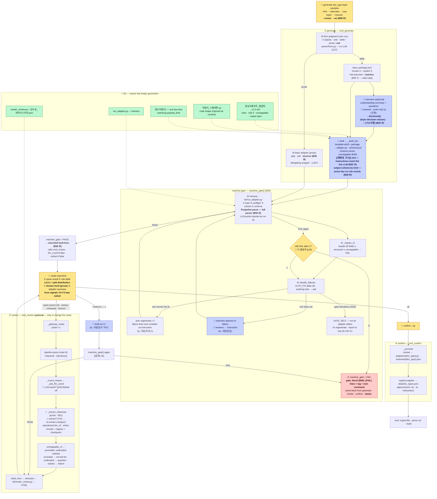

# 01 · 등록 흐름 — 어댑터·매칭 스키마가 만들어져 확정되기까지

> ← `00_전체_지도` · 다음 `02_파싱과_추출`
> **무엇**: `cli/register.py`의 3단(생성·검수·확정)이 어떤 함수를 거쳐 무엇을 주고받는지. **B48(파서 주입)·B49(전 열 판정)·B50(하네스→생성)·[정정] 40·B55(지시 템플릿·문답 누적)·B58(재등록·관문 범위·고정 prose 어댑터·형태 판정·뷰를 생성이) 반영본**이다.
> **정본**: 문서 6 §6.4~6.7 · 문서 1 M9·C19. 이 문서는 설명서다 — 갈리면 명세가 이긴다.
> **실물**: `cli/register.py` · `cli/interview.py` · `cli/prompt.py` · `parser/form.py` — 원격 `55f9c59`(B58 ⑤) 기준. **행 번호는 적지 않는다** — 밀린다. `grep -n`으로 찾는다.

## 한 장 흐름



## 무엇이 바뀌었나 — 옛 그림과의 차이

| Before (≤ B47) | Now | Why |
|---|---|---|
| 하네스가 **review 안**에서 돌고 FAIL을 표시만 했다 | 하네스가 **generate 안**(`machine_gate()`, `register.py:774`)에서 돌고 **통과분만 review로** | 사람이 `[FAIL]`을 읽어 자연어로 통역해 `--instruct`에 넣어야 했다. 사내는 코딩하지 않는다(C27) — 기계가 낸 판정을 사람이 되돌려주는 경로가 유일해선 안 된다(B50) |
| 실패는 전부 사람 몫 | **문면이 고칠 방법을 담으면 자동 재생성 1회**, 아니면 **문답** | `AUTO_FIX` 8줄(`:694`) · 목록 밖은 기본이 문답 — 새 하네스 항목이 생겨도 조용히 자동으로 흐르지 않는다 |
| UNMAPPABLE을 **차집합**으로 복원 → 뺀 열도 매번 질문 | 스키마 `unmappable[{field, kind, reason}]` · `excluded`는 제외 목록, `undecided`만 질문, **orphan은 FAIL** | 판정해서 뺀 열·판단 못 한 열·생성이 빠뜨린 열이 같은 줄로 떴다(B49). 불변식: 헤더 = fields ∪ 구조 필드 ∪ unmappable |
| `--instruct` 재생성분이 관문을 안 지났다 | 다시 `machine_gate()` | 사람 지시 한 번으로 「통과분만 확정」이 뚫렸다([정정] 40) |
| 파서가 `USE_MOCK`을 직접 읽었다 | `injections()` 한 자리에서 함수 3종(summarize·pick_coord·map_structure)을 만들어 내려보낸다 | 파일 설정만으로 실호출을 켜면 core는 실호출·파서는 mock으로 갈렸다(B48) |
| 스켈레톤이 **경로 문자열**로, 참조 어댑터는 **주입 안 됨** | 본문으로 주입 · payload_kind에 맞는 참조 어댑터 1종 few-shot | LLM이 빈칸을 받은 적이 없어 매번 전체를 작문했다(B29) |
| 재생성 지시가 **실호출 LLM에 안 갔다** | 템플릿 v1.1의 `{{재생성_지시}}` 자리로 조립 — 전송 dict에 실린다 | 하네스 문면·`--instruct`·문답 답이 mock에서만 통했다(H20 · B55 ①) |
| 문답이 매번 **덮였다** | `hint.interview`가 **묶음으로 쌓인다** — 표본이 바뀌면 이전 묶음은 `stale`로 남는다 | 사람의 답은 다시 못 만든다(B55 ②) |
| 등록된 doc_type은 **다시 못 만들었다** | `--revise`(같은 이름 새 판 · 승인 이력 누적) · `--as <새이름>`(변형) | 「이름 중복」으로 generate 진입이 막혔다(H27 · B58 ①) |
| 관문이 어댑터 `extract`까지만 | **`pipeline.parse` 전 구간** — tagger·validator 포함 | 통과한 적 없는 구간에서 검수가 처음 깨졌다(B58 ②) |
| prose 기본 어댑터가 pptx뿐 | **pptx · pdf · xlsx/csv** 셋 — prose 등록의 생성 LLM 0회 | 어댑터가 분할하지 않는 이상 남는 일은 포맷이 정한다(B58 ③) |
| xlsx를 table로 읽을지 prose로 읽을지를 사람이 | **형태 판정**이 먼저 — 신호 5 투표, 애매하면 사람 | LLM 없이 결정적(C37 · B58 ④) |
| **review가 뷰를 만들었다** | **generate가 관문 PASS 뒤 `view.html`까지** · review는 뷰를 바꿀 때만 | 사람이 치는 것이 `generate` → `confirm` 둘(B58 ⑤) |

## 함수별 — 누가 무엇을 하나

### ① generate `cmd_generate(doc_type, layer, samples, hint, interview, no_fewshot, resume, use_basic)`

| Step | Function | Does | Output |
|---|---|---|---|
| 0 | `--resume` (`:455`) | 패키지 조립·문답을 건너뛰고 draft부터. 층·표본 인자는 무시(경고 1줄) | |
| 0′ | `basic_adapter_proposal` — **기본값이다**(B59 ③) | 표본이 전부 prose 포맷(`.pptx`·`.pdf`·xlsx/csv 산문)이면 **플래그 없이도** 「고정 어댑터로 갈까? [Y/n]」를 묻고 위임 래퍼로 등재 — LLM 0회. 비대화형이면 고정으로. LLM 생성으로 가려면 `--no-basic` | |
| 1 | `reader.read` → `reader.head` + **열 프로파일**(전 행 통계 · B39) | 표본 관찰 재료 | `system.reader_head` |
| 2 | `store.read(SKELETON_LIST)` | 골격 닫힌 목록 **스냅샷** | `system.skeleton_closed_list` |
| 3 | `layers/{층}/config.json` | 층 어휘 | `system.layer_vocabulary` |
| 4 | 조립 — **사람 4 + 시스템 5** | | `review/{dt}/input_package.json` |
| 5 | `_interview` | `--interview`일 때. 라운드마다 **즉시 저장**(`_persist`) — 죽어도 남는다. **이전 라운드를 받는다**(B55 ②) — 묶음으로 쌓이고 표본이 바뀌면 이전 묶음은 `stale`. **「진행」에 확정 요약 `decisions[]`를 내고 사람이 `[Y/n/수정]`**(B60 ②) — **생성 프롬프트에는 요약만 실리고 라운드 전문은 안 실린다.** 대화는 이력, 판단은 정본 | `human.hint.interview[]` · `human.hint.decisions[]` |
| 6 | `draft` → `_draft_live` | 템플릿 최신판(`_newest_template` — **v1.2**, 경계선 3+3) + 패키지 원문 → `llm.chat(generate_schema(kind))`. **산출 스키마가 계열로 갈린다**(B58 ⑥) — `payload_kind_of_samples`가 형태 판정을 읽고, prose면 role 집계 3종이 스키마에 없다. **재생성 지시는 `{{재생성_지시}}` 자리로 조립된다**(B55 ① — 렌더 뒤 이어붙이기가 아니다) | `review/{dt}/adapter.py · schema.json` |
| 7 | **`machine_gate()`** | 아래 | `machine_gate` PASS/FAIL |
| 8 | **PASS → `cmd_review(llm_coord=False, extract=False)`** (B58 ⑤) | **뷰를 여기서 만든다** — 같은 함수, 비용 관문(좌표 LLM·추출 리허설)만 끈 채. 경로를 찍는다 | `review/{dt}/view.json · view.html` |

### machine gate `machine_gate(doc_type, st, samples, pkg)` — B50

| Step | Function | Does |
|---|---|---|
| a | `harness()` → `kit/run_adapter.py` | ①로드(문법·순수성·규약 10) ②preflight(양식 지문) ③extract 실행 ④스키마 정합 **⑤`pipeline.parse` 전 구간**(tagger·validator — LLM 지점은 무동작 주입 · B58 ②). **통과하면 검수에서 기계 오류가 날 자리가 없어야 한다 — 남으면 결함** |
| b | `_orphan_of` (`:719`) | 원본 헤더 중 `fields`·구조 필드·`unmappable` 어디에도 없는 열 → FAIL |
| c | `classify_failures` | `[FAIL]` 줄을 **셋**으로 가른다(B59 · D-135) — `AUTO_FIX`에 있으면 **auto** · 문면이 결과만 말하면 **ask + 원문 동봉**(예외 메시지·validator 결함 목록이 문답 지시에 실린다) · 어댑터 결함이 아니면 **`GATE_SELF`**(재생성 안 함). 태그(`G13`…)의 정본은 `kit/run_adapter.py`의 `LINE_RE` |
| d | auto → `draft(rev+1)` · 지시 = 실패 문면 그대로 · `by: 자동(하네스)` | 통역 없음 |
| e | ask → `_interview(context=ask)` | 생성 전 문답과 같은 장치. 답이 지시가 된다 · `by: 사람(문답)` |
| f | 1회 후 FAIL → `_ask_more` **[y/N]** | 비대화형이면 끄고 FAIL |
| g | FAIL이면 **뷰를 만들지 않고 `gate_block`을 찍는다**(B59) | `[FAIL]` 줄 원문 + 태그 + 칠 수 있는 다음 명령. `review`·`confirm`·`status`도 같은 블록 — **같은 함수**. `harness_out` 머리에 `ROOT`·`git <sha>+dirty`. **관문을 못 지난 산출로 기존 뷰를 갈아 치우지 않는다**([정정] 40 성질) |

**AUTO_FIX 8줄**: 규약 10 재구현 · `source_locator` 유일 · 원본 헤더 미포함 · role 5종 밖 · 스키마 밖 필드 · doc_type 불일치 · 필수 키 4종 · 헤더 4키. **그 밖 전부 문답** — 조각 0건 · extract 예외 · prose 조각 text/image_ref 등.

### ② review `cmd_review(doc_type, instruct, rows, llm_coord)` — **선택 명령** (B58 ⑤)

**generate가 이미 뷰를 만들었다.** 들어가는 이유는 셋 — `--instruct`로 재생성 · 좌표 LLM 보조를 켜서 · prose 추출 리허설을 켜서. 셋 다 아니면 `confirm`으로 바로 간다.

| Step | Function | Does |
|---|---|---|
| 0 | `--instruct` → `draft(rev+1)` → **`machine_gate()`** | 사람 지시 재생성도 관문을 다시 지난다([정정] 40). FAIL이면 **기존 뷰를 덮지 않는다** |
| 1 | `_gateway_ready()` | probe 1회 — 실패면 즉시 정지 |
| 2 | `pipeline.parse(rows=N)` + `injections()` | 리허설 파싱(기본 앞 200행 — 뷰에 필수 표시). 좌표 보조만 사람이 끌 수 있다 |
| 3 | `_coord_misses` → `_ask_llm_coord` | 미스를 무LLM으로 세고 **켤지 묻는다** — 켜면 미스 수만큼 실호출 |
| 3′ | `_extract_rehearsal` (prose · `machine_gate == PASS`일 때) | **켤지 묻는다**(`--extract/--no-extract`) — 켜면 `cli.extract.run(layer=)`을 **운영 doc_id**로 불러 청크별 개체·관계·부착 후보를 ②구획에 싣는다. 운영과 같은 함수라 **청크·등록부·체크포인트가 그 시점에 쓰인다**(§6.6 B51-2) — 확정 뒤 인입은 재인입이고 체크포인트를 재사용한다. `--rows`로 잘렸으면 체크포인트를 남기지 않는다 |
| 4 | `unmappable_of` (`:917`) → 3분류 | `excluded` → normal 제외 목록(사유 병기) · `undecided` → question · `orphan` → failure |
| 5 | `build_view` → `render_review.py` | 뷰 데이터(D-79 계약 — 정본은 `kit/검수뷰_데이터스키마.json`) → 정적 HTML. 렌더러는 계산하지 않는다. **prose는 분할 분포·고른 레벨·사유·짧은 쪽/긴 쪽이, 형태 판정이 사람에게 올라왔으면 신호 5 표가** 실린다(B58 ⑤) |

**review에서 입력을 받는 건 좌표 LLM 보조 `[y/N]`와 prose 추출 리허설 `[Y/n]` 둘이다.** UNMAPPABLE 줄은 표시이지 질문이 아니며 confirm을 막지 않는다.

### ③ confirm `cmd_confirm(doc_type, approved_by)`

조건 셋 — `state.json` 존재 · `machine_gate == PASS` · `--by`. `_promote`가 `review/` → `adapters/{dt}.py`·`schemas/{dt}.json`으로 **복사**하고, `registry.register`가 `data/doc_types.json`에 등재, `approval.json`에 승인자·시각·지시 이력(사람·자동 구분). **원본은 안 지운다.**

## 입력 패키지 — 사람 4 + 시스템 5 (§6.5)

| | Item | From |
|---|---|---|
| human 1 | 표본 문서 | 당신 |
| human 2 | doc_type 이름 | 당신 (중복 거부) |
| human 3 | 층 | 존재하는 층만 |
| human 4 | 힌트 · 문답 전문 | `--hint` · `--interview` |
| system 1 | `reader_head` — 앞 N행 원문 + **열 프로파일**(고유값·빈 셀 비율·대표값 · B39) | `parser/reader.py` · `parser/profile.py` |
| system 2 | `skeleton_closed_list` | 스냅샷 `data/skeleton_closed_list.json` |
| system 3 | `layer_vocabulary` | `layers/{층}/config.json` |
| system 4 | `blocks` | `schemas/blocks.json` |
| system 5 | `adapter_skeleton` — **본문**(B29) | `kit/어댑터_스켈레톤.py` |

## 명령

```bash
# 보통은 두 줄이다 (B58 ⑤)
python -m cli.register generate <doc_type> <층> <표본…> [--hint "…"] [--interview] [--use-basic]
python -m cli.register confirm  <doc_type> --by <승인자>

# 뷰를 바꾸고 싶을 때만
python -m cli.register review   <doc_type> [--rows N|all] [--instruct "…"] [--llm-coord] [--extract]

# 막혔을 때 — 왜 막혔고 무엇을 칠지
python -m cli.register status   <doc_type>                    # 관문을 다시 돌리고 블록 (B59·B60) — 저장값 안 믿는다

# 다시 만들 때
python -m cli.register generate <doc_type> --resume            # 패키지 재사용 · draft부터
python -m cli.register generate <doc_type> --revise            # 등록된 것의 새 판 (B58 ①)
python -m cli.register generate <doc_type> --as <새이름>        # 변형 등록
```

mock 모드면 셋 다 실행 전에 멈춘다 — `--allow-mock`(B48).

## 산출물 자리

| Path | What | Survives |
|---|---|---|
| `review/{dt}/input_package.json` | 재료 + 문답 전문 | 재현 근거 |
| `review/{dt}/adapter.py · schema.json` (`_revN`) | 초안들 | 검수 산출 — 버전 미추적 |
| `review/{dt}/state.json` | machine_gate · revision · instructions(by) | |
| `review/{dt}/view.json · view.html` | 검수 뷰 — **generate가 만든다**(B58 ⑤) | 승인 근거 |
| `review/{dt}/approval.json` | 승인 기록 | |
| **`adapters/{dt}.py` · `schemas/{dt}.json`** | **정본** — confirm이 놓는다 | 운영이 읽는 자리 |
| `data/doc_types.json` | 등록부 — `revision` 포함 | `register list` |
| `data/doc_registry.json` `routing.form` | 형태 판정 기록 — 신호 5·투표·판정·사람 선택 | 문턱 조정의 재료 |
