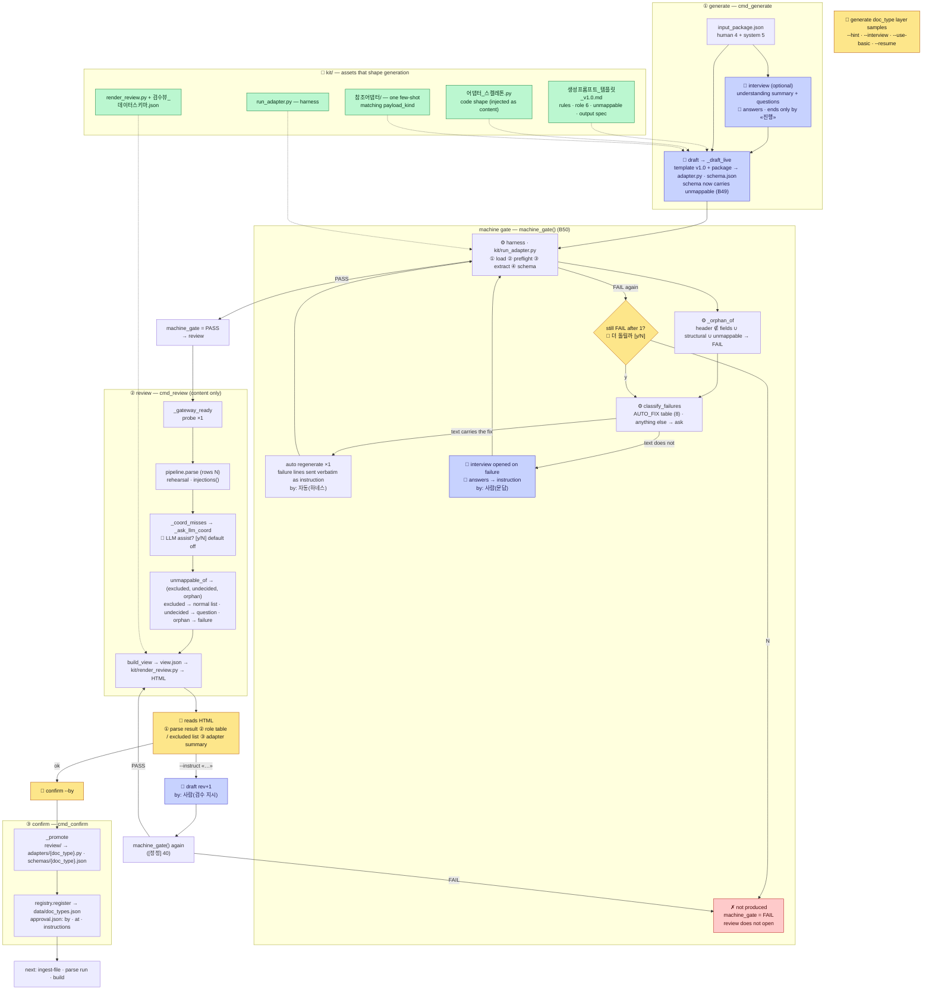

# 01 · 등록 흐름 — 어댑터·매칭 스키마가 만들어져 확정되기까지

> ← `00_전체_지도` · 다음 `02_파싱과_추출`
> **무엇**: `cli/register.py`의 3단(생성·검수·확정)이 어떤 함수를 거쳐 무엇을 주고받는지. **B48(파서 주입)·B49(전 열 판정)·B50(하네스→생성)·[정정] 40 반영본**이다 — 옛 `구축모드_흐름`·`register_구조도`를 통합했다.
> **정본**: 문서 6 §6.4~6.7 · 문서 1 M9·C19. 이 문서는 설명서다 — 갈리면 명세가 이긴다.
> **실물**: `cli/register.py` (2026-09-08 · 4f6123f). 행 번호는 그 시점이다.

## 한 장 흐름



## 무엇이 바뀌었나 — 옛 그림과의 차이

| Before (≤ B47) | Now | Why |
|---|---|---|
| 하네스가 **review 안**에서 돌고 FAIL을 표시만 했다 | 하네스가 **generate 안**(`machine_gate()`, `register.py:774`)에서 돌고 **통과분만 review로** | 사람이 `[FAIL]`을 읽어 자연어로 통역해 `--instruct`에 넣어야 했다. 사내는 코딩하지 않는다(C27) — 기계가 낸 판정을 사람이 되돌려주는 경로가 유일해선 안 된다(B50) |
| 실패는 전부 사람 몫 | **문면이 고칠 방법을 담으면 자동 재생성 1회**, 아니면 **문답** | `AUTO_FIX` 8줄(`:694`) · 목록 밖은 기본이 문답 — 새 하네스 항목이 생겨도 조용히 자동으로 흐르지 않는다 |
| UNMAPPABLE을 **차집합**으로 복원 → 뺀 열도 매번 질문 | 스키마 `unmappable[{field, kind, reason}]` · `excluded`는 제외 목록, `undecided`만 질문, **orphan은 FAIL** | 판정해서 뺀 열·판단 못 한 열·생성이 빠뜨린 열이 같은 줄로 떴다(B49). 불변식: 헤더 = fields ∪ 구조 필드 ∪ unmappable |
| `--instruct` 재생성분이 관문을 안 지났다 | 다시 `machine_gate()` | 사람 지시 한 번으로 「통과분만 확정」이 뚫렸다([정정] 40) |
| 파서가 `USE_MOCK`을 직접 읽었다 | `injections()` 한 자리에서 함수 3종(summarize·pick_coord·map_structure)을 만들어 내려보낸다 | 파일 설정만으로 실호출을 켜면 core는 실호출·파서는 mock으로 갈렸다(B48) |
| 스켈레톤이 **경로 문자열**로, 참조 어댑터는 **주입 안 됨** | 본문으로 주입 · payload_kind에 맞는 참조 어댑터 1종 few-shot | LLM이 빈칸을 받은 적이 없어 매번 전체를 작문했다(B29) |

## 함수별 — 누가 무엇을 하나

### ① generate `cmd_generate(doc_type, layer, samples, hint, interview, no_fewshot, resume, use_basic)`

| Step | Function | Does | Output |
|---|---|---|---|
| 0 | `--resume` (`:455`) | 패키지 조립·문답을 건너뛰고 draft부터. 층·표본 인자는 무시(경고 1줄) | |
| 0′ | `--use-basic` → `basic_adapter_proposal` (`:507-516`) | 표본이 전부 `.pptx`면 코어 기본 어댑터를 **위임 래퍼**로 등재 — LLM 0회 | |
| 1 | `reader.read` → `reader.head` + **열 프로파일**(전 행 통계 · B39) | 표본 관찰 재료 | `system.reader_head` |
| 2 | `store.read(SKELETON_LIST)` | 골격 닫힌 목록 **스냅샷** | `system.skeleton_closed_list` |
| 3 | `layers/{층}/config.json` | 층 어휘 | `system.layer_vocabulary` |
| 4 | 조립 — **사람 4 + 시스템 5** | | `review/{dt}/input_package.json` |
| 5 | `_interview` (`:597`) | `--interview`일 때. 라운드마다 **즉시 저장**(`_persist`) — 죽어도 남는다 | `human.hint.interview` |
| 6 | `draft` → `_draft_live` | 템플릿 최신판(`_newest_template`) + 패키지 원문 → `llm.chat(GENERATE_SCHEMA)` | `review/{dt}/adapter.py · schema.json` |
| 7 | **`machine_gate()`** (`:774`) | 아래 | `machine_gate` PASS/FAIL |

### machine gate `machine_gate(doc_type, st, samples, pkg)` — B50

| Step | Function | Does |
|---|---|---|
| a | `harness()` → `kit/run_adapter.py` | ①로드(문법·순수성·규약 10) ②preflight(양식 지문) ③extract 실행 ④스키마 정합 |
| b | `_orphan_of` (`:719`) | 원본 헤더 중 `fields`·구조 필드·`unmappable` 어디에도 없는 열 → FAIL |
| c | `classify_failures` (`:706`) | `[FAIL]` 줄을 **AUTO_FIX 표**로 가른다 — 문면이 답을 담으면 auto, 아니면 ask. **목록 밖 = ask** |
| d | auto → `draft(rev+1)` · 지시 = 실패 문면 그대로 · `by: 자동(하네스)` | 통역 없음 |
| e | ask → `_interview(context=ask)` | 생성 전 문답과 같은 장치. 답이 지시가 된다 · `by: 사람(문답)` |
| f | 1회 후 FAIL → `_ask_more` **[y/N]** | 비대화형이면 끄고 FAIL |
| g | FAIL이면 **review로 넘어가지 않는다** | 산출은 `review/`에 남되 화면이 「검수로 넘어가지 않았다」 |

**AUTO_FIX 8줄**: 규약 10 재구현 · `source_locator` 유일 · 원본 헤더 미포함 · role 5종 밖 · 스키마 밖 필드 · doc_type 불일치 · 필수 키 4종 · 헤더 4키. **그 밖 전부 문답** — 조각 0건 · extract 예외 · prose 조각 text/image_ref 등.

### ② review `cmd_review(doc_type, instruct, rows, llm_coord)` — 내용 판단만

| Step | Function | Does |
|---|---|---|
| 0 | `--instruct` → `draft(rev+1)` → **`machine_gate()`** (`:1213`) | 사람 지시 재생성도 관문을 다시 지난다([정정] 40). FAIL이면 뷰를 안 만든다 |
| 1 | `_gateway_ready()` | probe 1회 — 실패면 즉시 정지 |
| 2 | `pipeline.parse(rows=N)` + `injections()` | 리허설 파싱(기본 앞 200행 — 뷰에 필수 표시). 좌표 보조만 사람이 끌 수 있다 |
| 3 | `_coord_misses` → `_ask_llm_coord` | 미스를 무LLM으로 세고 **켤지 묻는다** — 켜면 미스 수만큼 실호출 |
| 4 | `unmappable_of` (`:917`) → 3분류 | `excluded` → normal 제외 목록(사유 병기) · `undecided` → question · `orphan` → failure |
| 5 | `build_view` → `render_review.py` | 뷰 데이터(D-79 계약) → 정적 HTML. 렌더러는 계산하지 않는다 |

**review에서 입력을 받는 건 좌표 LLM 보조 `[y/N]` 하나다.** UNMAPPABLE 줄은 표시이지 질문이 아니며 confirm을 막지 않는다.

### ③ confirm `cmd_confirm(doc_type, approved_by)`

조건 셋 — `state.json` 존재 · `machine_gate == PASS` · `--by`. `_promote`가 `review/` → `adapters/{dt}.py`·`schemas/{dt}.json`으로 **복사**하고, `registry.register`가 `data/doc_types.json`에 등재, `approval.json`에 승인자·시각·지시 이력(사람·자동 구분). **원본은 안 지운다.**

## 입력 패키지 — 사람 4 + 시스템 5 (§6.5)

| | Item | From |
|---|---|---|
| human 1 | 표본 문서 | 당신 |
| human 2 | doc_type 이름 | 당신 (중복 거부) |
| human 3 | 층 | 존재하는 층만 |
| human 4 | 힌트 · 문답 전문 | `--hint` · `--interview` |
| system 1 | `reader_head` — 앞 N행 원문 + **열 프로파일**(고유값·빈 셀 비율·대표값 · B39) | `parser/reader.py` · `parser/profile.py` |
| system 2 | `skeleton_closed_list` | 스냅샷 `data/skeleton_closed_list.json` |
| system 3 | `layer_vocabulary` | `layers/{층}/config.json` |
| system 4 | `blocks` | `schemas/blocks.json` |
| system 5 | `adapter_skeleton` — **본문**(B29) | `kit/어댑터_스켈레톤.py` |

## 명령

```bash
python -m cli.register generate <doc_type> <층> <표본…> [--hint "…"] [--interview] [--use-basic]
python -m cli.register generate <doc_type> --resume                      # 패키지 재사용 · draft부터
python -m cli.register review   <doc_type> [--rows N|all] [--instruct "…"] [--llm-coord|--no-llm-coord]
python -m cli.register confirm  <doc_type> --by <승인자>
```

mock 모드면 셋 다 실행 전에 멈춘다 — `--allow-mock`(B48).

## 산출물 자리

| Path | What | Survives |
|---|---|---|
| `review/{dt}/input_package.json` | 재료 + 문답 전문 | 재현 근거 |
| `review/{dt}/adapter.py · schema.json` (`_revN`) | 초안들 | 검수 산출 — 버전 미추적 |
| `review/{dt}/state.json` | machine_gate · revision · instructions(by) | |
| `review/{dt}/view.json · view.html` | 검수 뷰 | 승인 근거 |
| `review/{dt}/approval.json` | 승인 기록 | |
| **`adapters/{dt}.py` · `schemas/{dt}.json`** | **정본** — confirm이 놓는다 | 운영이 읽는 자리 |
| `data/doc_types.json` | 등록부 | `register list` |
