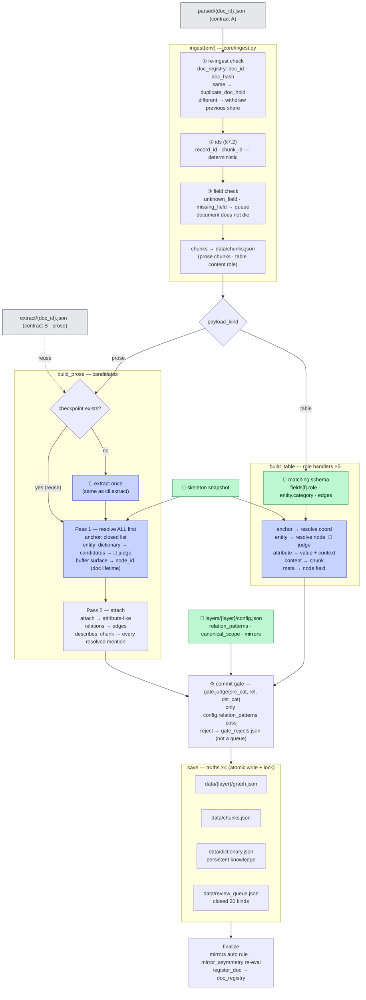

# 03 · 구축 — 계약 JSON(+추출 후보)이 그래프가 되기까지

> ← `02_파싱과_추출` · 다음 `04_질의`
> **무엇**: `run.py build`가 받는 것부터 진실 4벌이 갱신되기까지. **추출은 앞 단계(02)다** — build는 prose면 체크포인트를 읽고, 없으면 그 자리에서 추출을 한 번 부른다. 옛 `쓰기절차_설명서`를 갱신했다.
> **정본**: 문서 4(쓰기 절차) · 문서 2 §2.7. 갈리면 정본이 이긴다.
> **실물**: `core/pipeline.py::run_document` · `core/ingest.py` · `core/build.py` · `core/gate.py` · `core/store.py` (4f6123f).

## 한 장 흐름

**한 줄**: 쓰기는 "행을 넣는 것"이 아니라 **"행이 가리키는 것을 먼저 판정하는 것"**이다. 판정(Pass 1)이 끝나야 부착(Pass 2)이 시작되고, 부착도 게이트를 지나야 저장된다. 판정이 안 서는 것은 버리지 않고 **전부 큐로** 간다.

## ① 재인입 검사 — 같은 문서인가, 개정판인가

| Situation | Action |
|---|---|
| 처음 보는 doc_id | 등록 후 진행 |
| 같은 doc_id · 같은 hash | `duplicate_doc_hold` 보류 — 해제는 사람(`--allow-duplicate`가 ㉡ 해제) |
| 같은 doc_id · **다른 hash (개정판)** | **이전 몫을 먼저 걷어낸다**(`withdraw`) — 그 문서가 만든 청크·describes·provenance 회수 후 새로 쓴다. 회수 없이 덮으면 개정이 아니라 중첩이다(§4.8). 청크가 바뀌었으므로 **추출 체크포인트도 버린다**(`extract.invalidate`) |

**재인입은 상시 상태다** — 사내 문서는 개정된다. doc_id가 파일명이므로(D-110) 같은 파일을 다시 넣는 것이 개정판 재인입이다. **사람의 판단이 기록된 큐 항목(`resolution` 있음)은 회수하지 않는다**(H6).

## ② 갈림 — table은 직행, prose는 추출을 거친다

| | Table | Prose |
|---|---|---|
| 의미의 근거 | 매칭 스키마 `fields[f].role` — 등록 때 고정 | `extract/{doc_id}.json` — **02 단계 산출** |
| build가 하는 것 | role 핸들러 5종 루프(`HANDLERS` — `pipeline.py:340`) | 후보 해소 → 부착 |
| LLM | 개체 판정(②)만 — 사전 미스일 때 | 추출(①) — 체크포인트 없을 때만 · 개체 판정(②) |
| 완주 조건 | **LLM 없이 그래프까지 가능** | 추출 1회 필요 |

**체크포인트는 「파일 존재 = 추출 완료」다.** `cli.extract`로 먼저 만들었으면 build는 `[추출 체크포인트 재사용]`을 찍고 안 부른다. 프롬프트를 바꿔도 파일이 있으면 재추출하지 않는다 — `cli.extract --force`.

## ③ Pass 1 해소 — 문서 전체를 먼저

문서의 모든 anchor·entity를 **먼저 전부** 판정해 버퍼(표면형→node_id, 수명 = 문서 1개)에 담는다. 뒤 행이 앞 행의 개체를 가리켜도 되는 이유가 이 분리다.

| Target | How | Result |
|---|---|---|
| **anchor**(좌표) | 골격 닫힌 목록 대조 | 일치 → 해소 · 목록 밖 → **값 보존 + `orphan_anchor`** · 실존하나 관계 불일치 → `coord_mismatch` |
| **entity** | ①동의어 사전 히트(무LLM) → ②후보 수집 → ③🤖 판정(`core/matcher.match` · 지점 ②) | 매칭 / 신규(`auto_node`) / 불확실 → 신규 + `uncertain_match` |
| 카테고리가 어느 층에도 없다 | `layer_of_category` (`build.py:299`) | `invalid_category` — 노드 안 만듦 |

**비용의 모양**: 개체 판정 LLM은 **행 수가 아니라 고유 표면형 수**에 비례한다. 같은 표면형은 첫 판정 후 사전 히트다 — PFMEA 4천 행에 고장모드 40종이면 판정 40회 언저리. 좌표 LLM 보조(⑨)는 다르다 — 미스 **행마다**라 등록 검수에 동의 관문이 있다.

## ④ Pass 2 부착 — 값·근거·관계

- **attribute**: 값 + 맥락(context). **같은 맥락에 다른 값이면 조용히 덮지 않는다** → `spec_conflict`.
- **describes**: 청크 → 노드 근거. prose의 순회 단위는 청크이고, **해소된 언급 전부**에 건다 — 엣지 성립과 무관. 링킹 0건 청크도 저장된다(`linked: false`).
- **edges**: 관계 생성 — 스스로 저장하지 못하고 게이트를 지난다.

## ⑤ 커밋 게이트 — config에 없는 관계는 저장되지 않는다

`gate.judge(src_cat, rel, dst_cat)` — 층 config의 `relation_patterns`에 선언된 조합만 통과. **거부는 큐가 아니라 `gate_rejects.json`**: 큐는 "사람이 판정할 것", 게이트 거부는 "선언 밖이라 판정 대상도 아닌 것"의 관측.

**함정**: 넣었다고 생각한 관계가 그래프에 없으면 **먼저 `gate_rejects.json`을 연다.** 고칠 곳은 코드가 아니라 층 config의 패턴이고, 그것은 층 개정 절차를 탄다(05 조절 지도 Q4).

## ⑥ 저장 — 진실 4벌 + 큐 20종

| File | What | Look |
|---|---|---|
| `data/{층}/graph.json` | 노드·엣지 — GraphStore 경유만(B6) | `show node` · `export html` |
| `data/chunks.json` | 원문 전량 + describes | `show chunk` |
| `data/dictionary.json` | 동의어 사전 — **영속 지식**. 판정이 쌓일수록 다음 인입이 싸진다 | 노드 상세의 별칭 |
| `data/review_queue.json` | **닫힌 20종** — 새 kind는 판정 없이 만들지 않는다 | kind별 조회 |
| `data/gate_rejects.json` | 게이트 거부 관측 | 직접 열람 |

**큐 20종(문서 4 §4.7 정본)**: `auto_node` · `uncertain_match` · `orphan_anchor` · `orphan_chunk_link` · `orphan_attach` · `attach_conflict` · `structural_proposal` · `direction_unverifiable` · `parse_failure` · `duplicate_doc_hold` · `spec_conflict` · `evidence_lost` · `mirror_asymmetry` · `unknown_field` · `missing_field` · `invalid_category` · `direction_conflict` · `coord_mismatch` · `adapter_mismatch` · `hierarchy_unresolved`.

**큐가 쌓이는 것은 고장이 아니라 시스템이 일하는 모양이다** — "조용히 버리지 않는다"(G5)의 물리적 형태. 실문서 첫 인입에서 `orphan_anchor`·`mirror_asymmetry`가 대량이면 ①골격 alias 부족(가장 흔함) ②문서 표기 ③진짜 신규, 순서로 본다.

## 확인 루틴 — 인입 한 번 하고 볼 것

1. `[인입] {doc_id}: record N · chunk M` — 기대한 규모인가 (0이면 스키마 `fields`나 추출을 의심)
2. prose면 `show extract <doc_id>` — 뭐가 뽑혔나 (02)
3. `show node <이름>` — 값·별칭·근거 청크가 달렸는가 (**답의 뒷면**)
4. 큐 — 새로 쌓인 kind와 건수. `orphan_anchor`가 예상 밖으로 많으면 골격 alias부터
5. 관계가 없으면 `gate_rejects.json`
