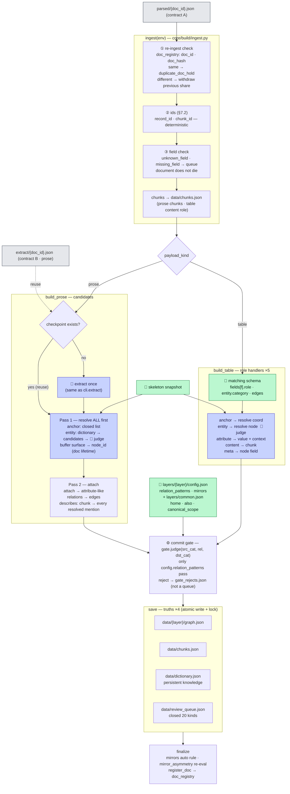

# 03 · 구축 — 계약 JSON(+추출 후보)이 그래프가 되기까지

> ← `02_파싱과_추출` · 다음 `04_질의`
> **무엇**: `run.py build`가 받는 것부터 진실 4벌이 갱신되기까지. **추출은 앞 단계(02)다** — build는 prose면 체크포인트를 읽고, 없으면 그 자리에서 추출을 한 번 부른다. 옛 `쓰기절차_설명서`를 갱신했다.
> **정본**: 문서 4(쓰기 절차) · 문서 2 §2.7. 갈리면 정본이 이긴다.
> **실물**: `core/build/entry.py::run_document`(옛 `pipeline.py` → entry·loop·table·prose — B78-2) · `core/build/ingest.py` · `core/build/build.py` · `core/build/gate.py` · `core/state/store.py`. **B57 반영**(provenance 접두 · 좌표 값 부재 사다리 · 빌드 측정치).

> **자리(B78)**: 아래의 `review/`·`data/`·`parsed/`·`extract/`·`export/`는 전부 상태 루트 `$ONTO_HOME/` 아래다 — `review/`는 `registry/review/`(②등록), `data/`는 ③진실, `parsed/`·`extract/`·`struct_maps/`·`ingest_log/`는 `work/`(④). 정본은 문서 7 §7.1·§7.8, 운영자용은 `가이드/상태_폴더_가이드.md`.

## 한 장 흐름

```mermaid
flowchart TD
  PJ["parsed/{doc_id}.json  (contract A)"]
  EJ["extract/{doc_id}.json  (contract B · prose)"]

  subgraph ING["ingest(env) — core/build/ingest.py"]
    direction TB
    RE["① re-ingest check<br/>doc_registry: doc_id · doc_hash<br/>same → duplicate_doc_hold<br/>different → withdraw previous share"]
    ID["② ids (§7.2)<br/>record_id · chunk_id — deterministic"]
    FC["③ field check<br/>unknown_field · missing_field → queue<br/>document does not die"]
    CH["chunks → data/chunks.json<br/>(prose chunks · table content role)"]
    RE --> ID --> FC --> CH
  end
  PJ --> RE

  BR{"payload_kind"}
  CH --> BR

  subgraph TB["build_table — role handlers ×5"]
    direction TB
    SC["📄 matching schema<br/>fields[f].role · entity.category · edges"]
    HD["anchor → resolve coord<br/>entity → resolve node  🤖 judge<br/>attribute → value + context<br/>content → chunk<br/>meta → node field"]
    SC --> HD
  end

  subgraph PB["build_prose — candidates"]
    direction TB
    CK{"checkpoint exists?"}
    EX["🤖 extract once<br/>(same as cli.extract)"]
    P1["Pass 1 — resolve ALL first<br/>anchor: closed list<br/>entity: dictionary → candidates → 🤖 judge<br/>buffer surface → node_id (doc lifetime)"]
    P2["Pass 2 — attach<br/>attach → attribute-like<br/>relations → edges<br/>describes: chunk → every resolved mention"]
    CK -- "no" --> EX --> P1
    CK -- "yes (reuse)" --> P1
    P1 --> P2
  end
  BR -- "table" --> SC
  BR -- "prose" --> CK
  EJ -. "reuse" .-> CK

  GT["⚙ commit gate — gate.judge(src_cat, rel, dst_cat)<br/>only config.relation_patterns pass<br/>reject → gate_rejects.json (not a queue)"]
  HD --> GT
  P2 --> GT

  subgraph SAVE["save — truths ×4  (atomic write + lock)"]
    direction LR
    G["data/{layer}/graph.json"]
    C["data/chunks.json"]
    D["data/dictionary.json<br/>persistent knowledge"]
    Q["data/review_queue.json<br/>closed 20 kinds"]
  end
  GT --> SAVE
  FIN["finalize<br/>mirrors auto rule · mirror_asymmetry re-eval<br/>register_doc → doc_registry"]
  SAVE --> FIN

  CFG["📄 layers/{layer}/config.json<br/>relation_patterns · mirrors<br/>+ layers/common.json<br/>home · also · canonical_scope"] --> GT
  SK["📄 skeleton snapshot"] --> P1
  SK --> HD

  classDef llm fill:#c7d2fe,stroke:#4338ca,color:#1e1b4b
  classDef asset fill:#bbf7d0,stroke:#15803d,color:#052e16
  classDef file fill:#e5e7eb,stroke:#374151
  class EX,HD,P1 llm
  class SC,CFG,SK asset
  class PJ,EJ file
```

**한 줄**: 쓰기는 "행을 넣는 것"이 아니라 **"행이 가리키는 것을 먼저 판정하는 것"**이다. 판정(Pass 1)이 끝나야 부착(Pass 2)이 시작되고, 부착도 게이트를 지나야 저장된다. 판정이 안 서는 것은 버리지 않고 **전부 큐로** 간다.

## ① 재인입 검사 — 같은 문서인가, 개정판인가

| Situation | Action |
|---|---|
| 처음 보는 doc_id | 등록 후 진행 |
| 같은 doc_id · 같은 hash | `duplicate_doc_hold` 보류 — 해제는 사람(`--allow-duplicate`가 ㉡ 해제) |
| 같은 doc_id · **다른 hash (개정판)** | **이전 몫을 먼저 걷어낸다**(`withdraw`) — 그 문서가 만든 청크·describes·provenance 회수 후 새로 쓴다. 회수 없이 덮으면 개정이 아니라 중첩이다(§4.8). 청크가 바뀌었으므로 **추출 체크포인트도 버린다**(`extract.invalidate`) |

**무엇을 그 문서 몫으로 보나 — provenance의 접두다**(B57 · [정정] 43). 항목 형식이 **`{doc_id}#{source_locator}`**이므로 회수는 `#` 앞이 그 doc_id인 것 전부다. 파서가 내는 `source_locator`는 **문서 안에서만 유일**하면 되고(`Sheet1!R12`는 어느 엑셀에나 있다) 접두는 **에이전트가 그래프에 실을 때** 단다 — 접두가 없던 판에서는 두 문서가 같은 좌표를 가질 때 **남의 근거까지 걷혔다.** `seed`·`auto:{규칙명}` 항목은 문서 유래가 아니라 접두가 없다.

**재인입은 상시 상태다** — 사내 문서는 개정된다. doc_id가 파일명이므로(D-110) 같은 파일을 다시 넣는 것이 개정판 재인입이다. **사람의 판단이 기록된 큐 항목(`resolution` 있음)은 회수하지 않는다**(H6).

## ② 갈림 — table은 직행, prose는 추출을 거친다

| | Table | Prose |
|---|---|---|
| 의미의 근거 | 매칭 스키마 `fields[f].role` — 등록 때 고정 | `extract/{doc_id}.json` — **02 단계 산출** |
| build가 하는 것 | role 핸들러 5종 루프(`HANDLERS` — `pipeline.py:340`) | 후보 해소 → 부착 |
| LLM | 개체 판정(②)만 — 사전 미스일 때 | 추출(①) — 체크포인트 없을 때만(힌트 `tests/fixtures/extract_hints/`는 mock 자산 — `USE_MOCK=0`이면 읽지 않는다, B71 ①) · 개체 판정(②) |
| 완주 조건 | **LLM 없이 그래프까지 가능** | 추출 1회 필요 |

**체크포인트는 「파일 존재 = 추출 완료」다.** `cli.extract`로 먼저 만들었으면 build는 `[추출 체크포인트 재사용]`을 찍고 안 부른다. 프롬프트를 바꿔도 파일이 있으면 재추출하지 않는다 — `cli.extract --force`.

## ③ Pass 1 해소 — 문서 전체를 먼저

문서의 모든 anchor·entity를 **먼저 전부** 판정해 버퍼(표면형→node_id, 수명 = 문서 1개)에 담는다. 뒤 행이 앞 행의 개체를 가리켜도 되는 이유가 이 분리다.

| Target | How | Result |
|---|---|---|
| **anchor**(좌표) | 골격 닫힌 목록 대조 | 일치 → 해소 · 목록 밖(**미해소**) → **값 보존 + `orphan_anchor`** · 실존하나 관계 불일치 → `coord_mismatch` · **값 부재(null)** → 아래 사다리 |
| **entity — 어디서** | **집에서 해소한다** — 카테고리 C의 집(공통 config `home`)의 빌더가 매칭하고, 없으면 **집 그래프에** 만든다(`Builder.resolve_at_home` — table `loop.h_entity`와 prose `_build_prose_pass1`이 같은 함수를 부른다). 여러 층이 C를 선언해도 노드는 집에 하나다. 판정 대장·큐(`auto_node`·`uncertain_match`)의 `layer`는 집이다. 스키마 `target_layer`는 집과 같아야 한다(등록 관문 G4C) | 해소 순서: ⓪ **자기 좌표**(행·청크의 좌표 X가 C를 **겸하고** 표기가 사전에서 X 자신이면 → X · 새 노드 0 · 대장 `path=self_coord` · 키 조립 전) → ①~③(아래) · **골격 카테고리**(층 config `skeleton.category`)는 **조회 전용** — 매칭이면 그대로, 신규·불확실 갈래는 노드를 만들지 않고 `orphan_anchor`(골격 밖 표기 · 대장 verdict `orphan`) · **판정 기억**(B100 ⑤ — `Builder._memo_key`): 이 결과는 한 실행 안에서 (표기 · 카테고리 · 부모 스코프 · 극성 · 층 + 골격 판 · 이 표기의 사전 항목) 열쇠로 기억되어 둘째부터 후보·LLM 0 · 대장 `path=memo`(화면 「기억」) · 큐는 문서 × 표기 1건에 행만 붙는다 |
| **entity** | ①동의어 사전 히트(무LLM — 키는 스코프 canonical 조회 키 · 등재도 같은 키 · B74 ① · 정확 미스면 영문 대소문자 2차 대조(`ids.fold_latin` — 라틴 글자만 접는다 · 가리키는 것이 하나일 때만 · 둘 이상이면 미스 + 로그 · `norm`은 그대로 · B96) — `Dictionary.lookup` 한 자리) → ②후보 수집(주 카테고리 C인 노드 + **C를 겸하는 노드** — 겸은 공통 config `also`와 노드 `tier`로 계산) — **전량이 아니다**(B73 ①): 스코프 카테고리는 **먼저** 같은 부모 아래로 자른다(상한 무관 · **0개면 후보 0 → 그 자리에서 신규 · LLM 0** — B75 ②) → 유사도 상위 `CANDIDATE_TOP_N`(12 · 방법은 `CANDIDATE_NARROW`: 임베딩 또는 2-gram 겹침 · 임베딩 없어도 돈다 — B75 ① · 임베딩이면 **파싱 전 사전 점검이 이미 왕복했다** — B98 ①, `02` 「사전 점검」) → ③🤖 판정(`core/matcher.match` · 지점 ② — 후보에 `status`·`evidence`가 실리고 auto 후보에는 확신 1.0일 때만 붙는다) | 매칭 / 신규(`auto_node`) / 불확실 → 신규 + `uncertain_match`. auto는 `ops confirm/merge/obsolete`로 사람이 끝낸다(B73 ④) |
| 카테고리가 공통 config 카탈로그 밖이다 | `layer_of_category` = 카탈로그의 `home` (`core/state/catalog.py`) | `invalid_category` — 노드 안 만듦 |

**좌표가 비어 있는 행 — 사다리 셋**(B57 ② · 문서 2 §2.4-③). 「목록 밖」과 「값이 없다」는 다른 사건이다.

| Case | Disposition |
|---|---|
| `process_ref` 있음 | 정상 |
| `process_ref` null · `process_group` 있음 | **저해상도 부착** — 상위 개념 노드에 붙인다. 오류가 아니고 **큐도 달지 않는다** |
| 둘 다 null | **`missing_field`** + payload에 연쇄 드롭 재료 셋(`dropped_edges` · `pending_attrs` · `dropped_entities`) |

**셋째가 `orphan_*`이 아닌 이유**: orphan 계열은 「그래프가 자라면 풀린다」라 재시도 배치가 문다. 좌표가 빈 행은 **그래프가 아무리 자라도 안 풀린다** — 문서를 고쳐야 한다. 재시도의 손잡이가 아니라 **사람의 손잡이**로 싣는다. 접두 이전 판에서는 이 경로에 큐가 아예 안 생겨 그 행의 개체·값·엣지가 **무기록으로 사라졌다.**

**비용의 모양**: 개체 판정 LLM은 **행 수가 아니라 고유 표면형 수**에 비례한다. 같은 표면형은 첫 판정 후 사전 히트다 — PFMEA 4천 행에 고장모드 40종이면 판정 40회 언저리. 좌표 LLM 보조(⑨)는 다르다 — 미스 **행마다**라 등록 검수에 동의 관문이 있다.

## ④ Pass 2 부착 — 값·근거·관계

- **attribute**: 값 + 맥락(context). **같은 맥락에 다른 값이면 조용히 덮지 않는다** → `spec_conflict`.
- **describes**: 청크 → 노드 근거. prose의 순회 단위는 청크이고, **해소된 언급 전부**에 건다 — 엣지 성립과 무관. 링킹 0건 청크도 저장된다(`linked: false`).
- **about**(관련 링크 — 청크의 두 번째 매달림 · `chunks.json`의 `about`): 추출이 청크 단위로 낸 「이 글이 무엇에 관한가」(표면형 + 카테고리). **조회 전용** — 이 문서의 해소 버퍼 → 사전(카테고리 안 · 살아 있는 노드 · 유일할 때만)으로 찾고 노드를 만들지 않으며 판정 LLM도 부르지 않는다. 못 찾으면 버리고 `defects.log`에 「관련 링크 미해소」. 링크가 없으면 키도 없다.
- **개체별 부모**(Pass 1 — 이름을 정하기 전): 추출 entity의 선택 필드 `parent`가 **부모 후보**(`extract.parent_candidates` — 좌표 서브트리 + 청크 본문에 나오는 골격 이름 · 골격 스냅샷에서 결정적) 안이고 골격 노드로 해소되면 그것이 이름 부모다(주 좌표를 이긴다 — 「3. 스태킹」 아래 「전 공정(노칭)의 버」 → `노칭::버`). 후보 밖이면 null(주 좌표)과 「개체 부모 후보 밖」 기록. 필드가 없으면(옛 체크포인트·mock) 지금과 같다.
- **렌즈**(doc_type의 층 목록 · `core/build/lens.py`): 둘 이상이면 청크마다 렌즈마다 그 층 어휘로 추출하고(체크포인트 `extract/<doc>@<렌즈>.json`) 개체는 위의 집 해소로 한 노드에 모이며 엣지는 렌즈의 층에 선다. 관련성 거름(그 층 어휘 적중 — 영문 대소문자 무시 — < `lens_min_score`면 LLM 0) · 예고 · 상한(`lens_call_cap` — 넘으면 묻고 비대화형은 보류).
- **edges**: 관계 생성 — 스스로 저장하지 못하고 게이트를 지난다. **엣지는 뽑은 층(문서의 층)에 저장**하고 끝점은 제 집 그래프에서 읽는다 — 끝점이 다른 그래프면 걸침 엣지다(`commit_edge`의 `src_graph`·`dst_graph`). 삼항 검사는 **뽑은 층의 `relation_patterns`**다.

## ⑤ 커밋 게이트 — config에 없는 관계는 저장되지 않는다

`gate.judge(src_cat, rel, dst_cat)` — 층 config의 `relation_patterns`에 선언된 조합만 통과. 끝점의 카테고리는 **주 ∪ 겸**이다 — 주 쌍이 통과하지 못하면 겸 조합을 보고, 어느 조합이든 패턴에 있으면 통과한다(스테이션 노드에 `Component part_of Unit`이 바로 붙는다). **거부는 큐가 아니라 `gate_rejects.json`**: 큐는 "사람이 판정할 것", 게이트 거부는 "선언 밖이라 판정 대상도 아닌 것"의 관측.

**함정**: 넣었다고 생각한 관계가 그래프에 없으면 **먼저 `gate_rejects.json`을 연다.** 고칠 곳은 코드가 아니라 층 config의 패턴이고, 그것은 층 개정 절차를 탄다(05 조절 지도 Q4).

## ⑥ 저장 — 진실 4벌 + 큐 20종

**저장 순서와 되돌림 경계**(B99 ①②): 구축의 저장은 말미 한 자리(`entry._finish_build`)이고 순서가 계약이다 — ①정합 검사(이번 실행이 남긴 엣지·큐·사전이 가리키는 노드가 그래프에 있는가 · 어긋나면 `[결함]` + 아무것도 저장하지 않음) ②그래프 저장(걸침 층 → 문서 층) ③사전 저장(그래프 **뒤**). 구축이 **어떤 예외로 끝나도**(사람이 멈춤 · 일반 예외 · Ctrl-C) `run_document`의 경계 하나가 큐·청크를 스냅샷으로 되돌리고 그래프·사전은 디스크의 옛 판 그대로다 — 표·산문·렌즈가 이 경계를 지난다(추출 체크포인트·부분 파일은 남는다). **층 이름은 연 그래프의 폴더 이름**이다(`graph.layer` · `load_config`가 `"layer"`를 폴더 이름으로 맞춘다) — 한 빌드에서 같은 층 그래프는 한 번만 열고(하위 빌더 캐시에 뿌리도 든다), 둘째로 열려 하면 `[결함]`. 문서 끝 결과(`core/build/result.collect` — 층별 증감 · 이번/이전 큐 · 관문 버림 · LLM 지점별)는 판정 대장 파일에 붙는다. 판정 근거(B99 ⑨): 후보 임베딩은 실행 중 메모리에 한 번(`matcher._VEC`) · 대장 행에 좁힘 · 임베딩 최고 점수 · 불확실이면 가장 가까운 후보(LLM이 고른 것 / 가드가 내린 것 + 상위 3) — `uncertain_match` payload에도.

**큐 항목은 문서 × 사실 단위다**(B72 ②): `unknown_field`·`missing_field`·`orphan_anchor`·`orphan_attach`는 필드/표기마다 1건에 `rows`·`locators`·`items[]`. 재시도는 행 단위로 돈다. 인입 끝에 요약 한 줄 — `인입 끝 — 노드 +n(auto a) · 엣지 +m · 저해상도 부착 r행 · 큐: … · LLM 호출 k · 토큰 T(입력 I · 출력 O)`(토큰 표기는 `_screen.tokens` 하나 · B98 ③) · 값은 **이어지는 표**(기호 · 표기 · 카테고리/열 · 판정 · 경로 · 확신 · 노드/큐 — B98 ⑥) · 구축에서 실패하면 `추출 체크포인트는 남았다 — 같은 명령이면 재사용(LLM 0)` + 다음 줄(B98 ②) · 판정 전에 예고 한 줄(`판정 예고 — entity 값 N건(표기 k종 · 사전 히트 h종) → LLM ≤ N회` — 값의 수가 상한이다, D-151 ②). `--step`이면 7단계마다 멈춘다. 판정 중에는 진행 줄 `[판정] 값 i/N · 호출 k · 누적 토큰 t(입력 a · 출력 b)`, 끝에 `판정 — 호출 k · 사전 h · 스코프로 끝 s · 임베딩 e · 후보 평균 n.n(상한 12)`(B73 ①) · `ingest-dir`는 총계 한 줄. 문서가 실패로 끝나도 `이 문서까지 — LLM 호출 k · 토큰 t · 멈춘 단계`가 찍히고, `--step-every N`이면 판정 안에서 값 N개마다 멈춘다(`q` → `held` · 그래프·사전·큐 되돌림 — B75 ③). finalize의 `retry_orphans`는 **지문(층별 노드·엣지 수 + 골격 닫힌 목록 판 + 사전 판 — B100 ⑥)이 바뀐 때만** 돌고(별칭·골격 노드를 더하고 `bootstrap`하면 그래프 수가 그대로여도 다음 마무리에서 돈다 · `bootstrap` 끝 줄 `보류 n건(kind별) — 다음 인입 마무리에서 다시 붙는다`) · 큐는 **한 번 읽고 한 번 쓴다**(B100 ① — 연결한 항목은 되살리지 않는다 · `남음` = 쓰고 난 큐의 실제 수) · 항목에 `attempts`·`first_seen`·`last_tried`(payload 밖)를 남긴다 — 5회 뒤 「사람 판정 대기」(B73 ② · D-152 ③).

| File | What | Look |
|---|---|---|
| `data/{층}/graph.json` | 노드·엣지 — GraphStore 경유만(B6) | `show node` · `export html` |
| `data/chunks.json` | 원문 전량 + describes | `show chunk` |
| `data/dictionary.json` | 동의어 사전 — **영속 지식**. 판정이 쌓일수록 다음 인입이 싸진다 | 노드 상세의 별칭 |
| `data/review_queue.json` | **닫힌 20종** — 새 kind는 판정 없이 만들지 않는다 | kind별 조회 |
| `work/gate_rejects.json` | 게이트 거부 관측 | 직접 열람 |
| `work/build_metrics.json` | **빌드가 남기는 자기 측정치**(소요 초 · 층별 저장 바이트 — B57 ④). 계기판 7·8이 이것을 읽는다. **로그이지 큐가 아니다** | `platform gauges` |

**큐 20종(문서 4 §4.7 정본)**: `auto_node` · `uncertain_match` · `orphan_anchor` · `orphan_chunk_link` · `orphan_attach` · `attach_conflict` · `structural_proposal` · `direction_unverifiable` · `parse_failure` · `duplicate_doc_hold` · `spec_conflict` · `evidence_lost` · `mirror_asymmetry` · `unknown_field` · `missing_field` · `invalid_category` · `direction_conflict` · `coord_mismatch` · `adapter_mismatch` · `hierarchy_unresolved`.

**큐가 쌓이는 것은 고장이 아니라 시스템이 일하는 모양이다** — "조용히 버리지 않는다"(G5)의 물리적 형태. 실문서 첫 인입에서 `orphan_anchor`·`mirror_asymmetry`가 대량이면 ①골격 alias 부족(가장 흔함) ②문서 표기 ③진짜 신규, 순서로 본다.

## 확인 루틴 — 인입 한 번 하고 볼 것

1. `인입 끝 — 노드 +n · 엣지 +m · 큐 …` 요약 줄(반전 배경 · B81) — 기대한 규모인가. 그 위의 **값 줄**(`+ 이름 new …` · `? … uncertain` · `✗ … orphan` — 판단이 갈린 값만 · 대장 행의 투영)이 어디서 갈렸는지를 말하고, INFO 전량은 `work/logs/ingest-file_<날짜>.log`에 있다(화면은 WARNING부터 · `-v`면 화면에도) (노드 0이면 골격 미확정·좌표 전부 목록 밖 · record 0이면 스키마 `fields`나 추출을 의심) · 그 앞의 `판정 예고` 줄이 LLM 상한이다
2. prose면 `show extract <doc_id>` — 뭐가 뽑혔나 (02)
3. `show node <이름>` — 값·별칭·근거 청크가 달렸는가 (**답의 뒷면**)
4. 큐 — 새로 쌓인 kind와 건수. `orphan_anchor`가 예상 밖으로 많으면 골격 alias부터
5. 관계가 없으면 `gate_rejects.json`
6. `show node <이름>`의 **출처가 `{doc_id}#…` 꼴인가** — 접두 없는 항목이 보이면 그 문서는 재인입 회수에서 샌다(B57)
