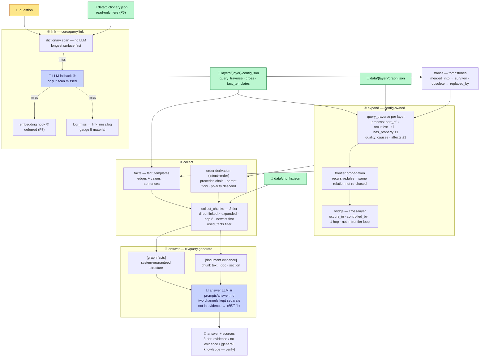

# 04 · 질의 — 질문이 근거 있는 답이 되기까지

> ← `03_구축` · 다음 `05_조절_지도`
> **무엇**: `run.py query "…"`가 질문을 받아 두 채널의 근거를 모으고 LLM이 그 근거로만 답하기까지. 옛 `구조_설명서` 「읽기」절을 단독 구조도로 뺐다.
> **정본**: 문서 5(읽기 절차). 갈리면 정본이 이긴다.
> **실물**: `cli/query.py::answer` · `core/query.py` (4f6123f).

## 한 장 흐름

**한 줄**: **코드가 그래프 연결성으로 근거를 고르고, LLM은 받은 근거로만 답한다.** LLM은 그래프를 직접 읽지 않는다(문서 0).

## 4단 — 각각 무엇을 정하나

| Stage | Who | Rule | Config knob |
|---|---|---|---|
| ① 링킹 | 코드 → 🤖 폴백 | 사전 스캔 우선(긴 표면형 우선). **앞 단이 히트하면 뒤 단을 돌지 않는다** — 히트했는데도 LLM을 부르면 미스율이 오염된다. 극성 링킹은 **넓게**(양 극성 다) | 사전 alias |
| ② 확장 | 코드 | `query_traverse` 스펙대로만. 프론티어 전파 — 새 노드에도 규칙 적용. 브리지(cross)는 1홉이고 **프론티어 루프에 넣지 않는다** — 넣으면 1홉이 층 전체로 번진다 | `query_traverse` · `cross` |
| ③ 수집 | 코드 | 2-tier(직접 링킹 노드 근거 > 확장 노드 근거) · **상한 8** · 최신순(`parsed_at`). `used_facts` 필터가 확장 결과를 좁힌다 — 안 좁히면 전량이 상한에서 잘려 오답 | `fact_templates` |
| ④ 답변 | 🤖 | 이원 채널을 **구분해** 받는다. 한 덩어리면 청크의 옛 서술이 그래프 사실을 덮는다. 근거 밖은 「모른다」 | `prompts/answer.md` |

**질의는 읽기 전용이다(P6)** — 질문에 나온 표기를 사전에 배우지 않는다. 사용자 입력은 비검증이라 사전을 오염시킨다.

## 이원 근거 채널

| Channel | What | Guarantees |
|---|---|---|
| **[그래프 사실]** | 링킹·확장 노드의 엣지·값을 `fact_templates`로 문장화 — *"노칭 다음 공정은 스태킹이다"* · *"노칭::노칭 정밀도의 규격: ±0.1mm (출처: CP01)"* | 시스템이 보증하는 구조 정보 |
| **[문서 근거]** | 수집된 청크 원문(청크 id·문서·섹션) | 서술 정보. **노드에서 원본으로 돌아가는 길** — provenance → 청크 → 원문 |

답변 3단: 근거 있음 → 근거 기반 + 출처 / 근거 없음 → 그 사실을 먼저 밝히고 **[일반지식 — 사내 검증 필요]** / flow 특례 — 골격 트리 + precedes 체인을 통째로 공급.

## 질문 유형 — 답의 소재지는 넷뿐

엣지 / 노드 필드 / 청크 / 그래프 밖. 문서 5 §5.3의 유형표(Q1~Q8)가 그 기준의 전수 열거다 — 예시 목록이 아니라 완전성 근거다. 새 유형이 나오면 넷 중 어디인지부터 본다.

## 무엇이 이연인가 — P7

| Item | Status | Trigger |
|---|---|---|
| 임베딩 검색(③단) | 훅만 · 호출부 0 | 링킹 미스율(계기판 5)이 쌓인 뒤 판정. `EMBED_MODEL`은 지금 설정하지 않는다 |
| 하이브리드 | 이연 | 같은 재료 |

## 확인 루틴

1. 답의 `[그래프 사실]`·`[문서 근거]`가 실제 문서와 맞는가 — 눈으로
2. `facts_before_filter` vs 최종 건수 — `used_facts`가 실제로 좁히는가
3. 특정 표기를 못 찾으면 **사전 alias**(05 R1) — 즉시 적용
4. 골든셋 — 유형당 15문항(§5.3), 기준 120. 계기판이 인상이 아니라 측정이 되는 조건
