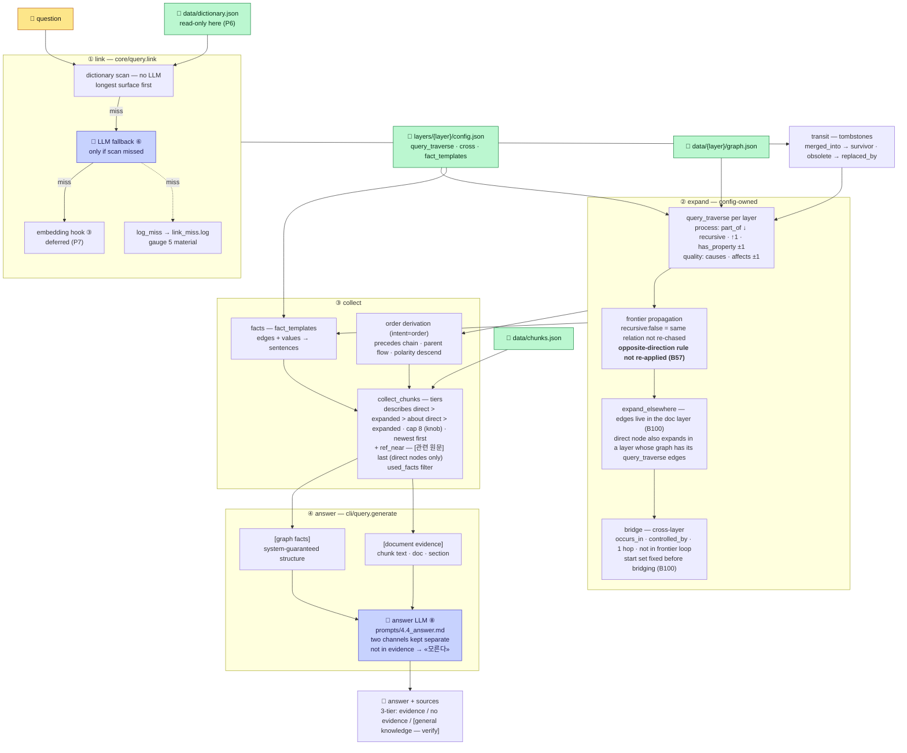

# 04 · 질의 — 질문이 근거 있는 답이 되기까지

> ← `03_구축` · 다음 `05_조절_지도`
> **무엇**: `run.py query "…"`가 질문을 받아 두 채널의 근거를 모으고 LLM이 그 근거로만 답하기까지. 옛 `구조_설명서` 「읽기」절을 단독 구조도로 뺐다.
> **정본**: 문서 5(읽기 절차). 갈리면 정본이 이긴다.
> **실물**: `cli/query.py::answer`(+`_answer_expand`·`_answer_collect` · B82) · `core/query/query.py` · `cli/viewer/`(server·data·static — B82 · 옛 `cli/viewer.py`는 패키지로) · `core/graph.py::neighbors(…, trace=)`(B57 ③ · B82 ③ 계측).

## 한 장 흐름


```mermaid
flowchart TD
  QN["👤 question"]

  subgraph L["① link — core/query.link"]
    direction TB
    L1["dictionary scan — no LLM<br/>longest surface first"]
    L2["🤖 LLM fallback ⑥<br/>only if scan missed"]
    L3["embedding hook ③<br/>deferred (P7)"]
    L1 -- "miss" --> L2 -- "miss" --> L3
    LM["log_miss → link_miss.log<br/>gauge 5 material"]
    L2 -. "miss" .-> LM
  end
  QN --> L1

  TR["transit — tombstones<br/>merged_into → survivor · obsolete → replaced_by"]
  L --> TR

  subgraph E["② expand — config-owned"]
    direction TB
    E1["query_traverse per layer<br/>process: part_of ↓ recursive · ↑1 · has_property ±1<br/>quality: causes · affects ±1"]
    E2["frontier propagation<br/>recursive:false = same relation not re-chased<br/><b>opposite-direction rule not re-applied (B57)</b>"]
    E4["expand_elsewhere — edges live in the doc layer (B100)<br/>direct node also expands in a layer whose graph has its query_traverse edges"]
    E3["bridge — cross-layer<br/>occurs_in · controlled_by · 1 hop · not in frontier loop<br/>start set fixed before bridging (B100)"]
    E1 --> E2 --> E4 --> E3
  end
  TR --> E1

  subgraph C["③ collect"]
    direction TB
    C1["facts — fact_templates<br/>edges + values → sentences"]
    C2["order derivation (intent=order)<br/>precedes chain · parent flow · polarity descend"]
    C3["collect_chunks — tiers<br/>describes direct > expanded > about direct > expanded · cap 8 (knob) · newest first<br/>+ ref_near — [관련 원문] last (direct nodes only)<br/>used_facts filter"]
    C1 --> C3
    C2 --> C3
  end
  E --> C1
  E --> C2

  subgraph A["④ answer — cli/query.generate"]
    direction TB
    CH1["[graph facts]<br/>system-guaranteed structure"]
    CH2["[document evidence]<br/>chunk text · doc · section"]
    AN["🤖 answer LLM ⑧<br/>prompts/4.4_answer.md<br/>two channels kept separate<br/>not in evidence → «모른다»"]
    CH1 --> AN
    CH2 --> AN
  end
  C3 --> CH1
  C3 --> CH2
  AN --> OUT["💬 answer + sources<br/>3-tier: evidence / no evidence / [general knowledge — verify]"]

  CFG["📄 layers/{layer}/config.json<br/>query_traverse · cross · fact_templates"] --> E1
  CFG --> C1
  DICT["📄 data/dictionary.json<br/>read-only here (P6)"] --> L1
  GR["📄 data/{layer}/graph.json"] --> E1
  CK["📄 data/chunks.json"] --> C3

  classDef llm fill:#c7d2fe,stroke:#4338ca,color:#1e1b4b
  classDef asset fill:#bbf7d0,stroke:#15803d,color:#052e16
  classDef human fill:#fde68a,stroke:#b45309,color:#1c1917
  class L2,AN llm
  class CFG,DICT,GR,CK asset
  class QN human
```

**한 줄**: **코드가 그래프 연결성으로 근거를 고르고, LLM은 받은 근거로만 답한다.** LLM은 그래프를 직접 읽지 않는다(문서 0).

## 4단 — 각각 무엇을 정하나

| Stage | Who | Rule | Config knob |
|---|---|---|---|
| ① 링킹 | 코드 → 🤖 폴백 | 사전 스캔 우선(긴 표면형 우선). **앞 단이 히트하면 뒤 단을 돌지 않는다** — 히트했는데도 LLM을 부르면 미스율이 오염된다. 극성 링킹은 **넓게**(양 극성 다) | 사전 alias |
| ② 확장 | 코드 | `query_traverse` 스펙대로만. 프론티어 전파 — 새 노드에도 규칙 적용. 브리지(cross)는 1홉이고 **프론티어 루프에 넣지 않는다** — 넣으면 1홉이 층 전체로 번진다. **한 관계에 규칙이 둘이면 방향이 반대인 규칙으로 도달한 노드에는 다시 적용하지 않는다**(B57 ③ — 공정층 `part_of`는 하향 재귀 + 상향 1홉이라 부모에서 하향이 다시 걸리면 형제 전부가 딸려 온다. 실측: 「노칭」 확장이 63 → 17로 줄고 빠진 46이 전부 형제 공정이었다) | `query_traverse` · `cross` |
| ③ 수집 | 코드 | tier 넷 — describes(직접 링킹 1 > 확장 2) → **관련 링크** `about`(직접 3 > 확장 4) · **상한 8**(손잡이 `collect_limit`) · 같은 tier는 최신순(`parsed_at`). 한 청크는 앞 tier로 한 번만. 그 뒤 **ref 노드 근처**(tier 5 · `query.ref_near`): 직접 링킹 노드의 표기(정식 이름·끝 조각·별칭)가 든 참조 시트 청크를 **읽을 때** 찾는다(저장 0 · 확장 노드 0 · 표기를 여럿 담은 청크 먼저 → 최신 · 상한 `ref_limit`). `used_facts` 필터가 확장 결과를 좁힌다 — 안 좁히면 전량이 상한에서 잘려 오답. trace의 `collection[].channel`이 `describes`·`about`·`ref`를 말한다 | `fact_templates` · `knobs.json` |
| ③′ 걸침 엣지 문장화 | 코드 | 걸침 엣지(저장된 층과 한쪽 끝점의 그래프가 다른 엣지)는 **저장한 층의 템플릿**으로 문장화한다(`query.cross_facts`). 다리로 닿은 것과 **층 안 확장으로 이미 닿은 것**(`query.stranded` — 양끝이 그 층의 수집에 들었고 한쪽이 다른 그래프)을 함께 싣고, 같은 엣지는 **한 번만**. 층 안 확장이 반대 끝점까지 데려오면 `facts`는 「이 층에 없는 끝점」으로, 다리는 「출발 집합으로 되돌아옴」으로 서로 미뤄 문장이 사라지던 자리다 | 저장 층의 `fact_templates` |
| ④ 답변 | 🤖 | 이원 채널을 **구분해** 받는다. 한 덩어리면 청크의 옛 서술이 그래프 사실을 덮는다. 근거 밖은 「모른다」 | `prompts/4.4_answer.md` |

**질의는 읽기 전용이다(P6)** — 질문에 나온 표기를 사전에 배우지 않는다. 사용자 입력은 비검증이라 사전을 오염시킨다.

## 이원 근거 채널

| Channel | What | Guarantees |
|---|---|---|
| **[그래프 사실]** | 링킹·확장 노드의 엣지·값을 `fact_templates`로 문장화 — *"노칭 다음 공정은 스태킹이다"* · *"노칭::노칭 정밀도의 규격: ±0.1mm (출처: CP01)"* | 시스템이 보증하는 구조 정보 |
| **[문서 근거]** | 수집된 청크 원문(청크 id·문서·섹션) | 서술 정보. **노드에서 원본으로 돌아가는 길** — provenance → 청크 → 원문 |
| **[관련 원문]** | 질문이 가리킨 노드의 이름이 **들어 있기만 한** 참조 시트 청크(있을 때만 · 묶음 `related`) | 참조 원문(목록·표) — 서술이 아니다. 답변 입력에서 따로 가르고 보충에만 쓴다(`prompts/4.4_answer.md` 한 줄) |

답변 3단: 근거 있음 → 근거 기반 + 출처 / 근거 없음 → 그 사실을 먼저 밝히고 **[일반지식 — 사내 검증 필요]** / flow 특례 — 골격 트리 + precedes 체인을 통째로 공급.

## 화면으로 보는 두 창구 (B52)

같은 `answer()` 하나를 두 꼴로 낸다 — **계산은 한 자리다.**

| Surface | Command | What |
|---|---|---|
| JSON | `python run.py query "<질문>" --json` | `answer()` 묶음 그대로 + `linked_nodes`(층·id·canonical) + `answer` 텍스트 + **`trace`**(B82 ③ — `intent`·`linking`·`hops[홉마다 {label, kind, nodes, edges}]`·`collection[{doc_id, source_locator, kept}]`·`facts(used)`·`answer`·`miss` · 문서 5 §5.2-6). 모드 줄은 **stderr**로 빠져 stdout이 깨끗하다 |
| Viewer | `python run.py viewer [--port N] [--no-browser]` | **세미 플랫폼**(B82) — 서버(`cli/viewer/server.py` · GET 10 라우트 · 127.0.0.1 · 쓰기 0)가 그래프(닻 · 연결 없는 노드 · 골격 뿌리)·이웃·노드 상세·문서·깔때기를 주고, 벤더링 WebGL(sigma·graphology — `static/vendor/` · 외부 URL 0)이 그린다. 테마 밝음|어두움 · 배치 **골격+위성**(기본)|계층|힘(셋 다 결정적 · 기억 · B84 · B103 — `static/layout.js`) · 연결 없는 노드 토글 · 탐색 모드(펼치기·접기·빵부스러기 · 이웃은 서버 · 문턱 손잡이) · 노드 상세의 근거(원문 · 닻까지의 길 · 붙은 자리) · 색 축(기본 category · tier 범례) · 엣지 rel 토글(걸침은 언제나 · 곡선+별색) · 필터·검색(강조만) · 드래그·hover 이웃·더블클릭 초점 · 노드→provenance→`/api/doc`→`/raw/` 원본 · 질의 오버레이 · 질의 오류는 서버 문면 그대로(링킹 칩 → 홉 경로 → 근거 청크 · `kept=false` 회색 · 미스 · 답) · 연결 현황(깔때기 + orphan 행) |

- **서버는 표준 라이브러리 · 실행 시 외부 URL 0.** 렌더러는 벤더링(MIT · 고정 버전 · `vendor/README.md`에 npm tarball 출처와 sha256 — 회귀가 기록 == 실물을 잰다). `cli/viewer.html`은 `export html` 스냅샷 전용으로 남는다.
- **쓰기 라우트가 없다** — 그래프·큐·사전에 쓰지 않는다(P6의 물리 형태 · 해시 불변을 회귀가 잰다). `/raw/`는 `_safe_under()` 하나가 잠근다(`..`·절대·탈출 4xx).
- **화면과 CLI는 `as_json` 하나를 먹는다** — 서버가 ⑧을 따로 부르지 않는다. 칠하는 것은 **trace에 적힌 것**뿐이다(링킹·홉·수집) — 추정하지 않는다.
- **닻은 서버 한 자리다**(B103 · `cli/viewer/anchor.py`) — 골격(`status: seed`)에서 동시에 넓이 우선(방향 없이 · 골격은 지나가지 않음 · 같은 거리면 골격 이름 순 · 홉 상한 6). 배치(골격+위성)와 노드 상세의 「닻까지의 길」이 같은 사실을 읽는다. 닻 없는 노드 = 엣지 없음 + 골격에 안 닿는 덩어리(기본 숨김) — 「엣지 없음」 수는 인입 끝 요약 「엣지 없는 노드」와 같은 정의다.
- **질의의 LLM 자리 둘이 화면에 보인다**(B103 ⑤) — 질의 패널 머리 배지: 모드(`mock`·`live`) · 「링킹 — 사전 a · LLM 폴백 b」(trace `linking[].method`) · 「답변 — LLM(live) / 정형 나열(mock)」(trace `answer.mode`). 근거 고르기는 코드다(문서 5 머리) — 배지는 trace의 투영이고 새 계산이 없다.
- 플랫폼(별도 레포)과 다른 것이다 — 이것은 **시스템 안의 검증 창구**다.

## 질문 유형 — 답의 소재지는 넷뿐

엣지 / 노드 필드 / 청크 / 그래프 밖. 문서 5 §5.3의 유형표(Q1~Q8)가 그 기준의 전수 열거다 — 예시 목록이 아니라 완전성 근거다. 새 유형이 나오면 넷 중 어디인지부터 본다.

## 무엇이 이연인가 — P7

| Item | Status | Trigger |
|---|---|---|
| 임베딩 검색(③단) | 훅만 · 호출부 0 | 링킹 미스율(계기판 5)이 쌓인 뒤 판정. `EMBED_MODEL`은 인입의 후보 좁히기에만 쓰인다(B75 ①·B80 ③) |
| 큐 처리 화면(뷰어에서 confirm·merge·obsolete) | 다음 회차 | 쓰기 API · 행위자 · 감사 로그 — 뷰어의 쓰기 0 규율을 그때 연다 |
| 하이브리드 | 이연 | 같은 재료 |

## 확인 루틴

1. 답의 `[그래프 사실]`·`[문서 근거]`가 실제 문서와 맞는가 — 눈으로
2. `facts_before_filter` vs 최종 건수 — `used_facts`가 실제로 좁히는가
3. 특정 표기를 못 찾으면 **사전 alias**(05 R1) — 즉시 적용
4. 골든셋 — 유형당 15문항(§5.3), 기준 120. 계기판이 인상이 아니라 측정이 되는 조건

   ```bash
   python run.py golden init          # 기준 구성대로 빈 문항 틀 (있으면 덮지 않는다)
   python run.py golden score [--k 8] # 채점 4축 + 틀린 문항 목록
   ```

   **채점 4축**(B54): 경로 일치 · 링킹 recall · 근거 적중@k · **BM-25@k**. 넷째가 상시 대조군이다 — *"일반 검색으로 되지 않느냐"*에 데이터로 답하는 자리이고, **대조군 없는 점수는 인상이지 측정이 아니다.** 채점은 `answer()`까지만 부른다(⑧ 미호출 — 재는 것은 근거 선택이지 문장이 아니다). `k`의 기본은 **수집 상한 8이며 그 값이 점수다** — 다른 k로 잰 값은 점수가 아니라 진단이다. `golden/`은 레포가 **추적하지 않는다**(사내 실문서 인용 — 반출입 경계 안쪽).
