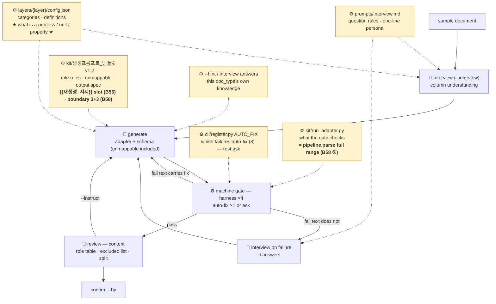
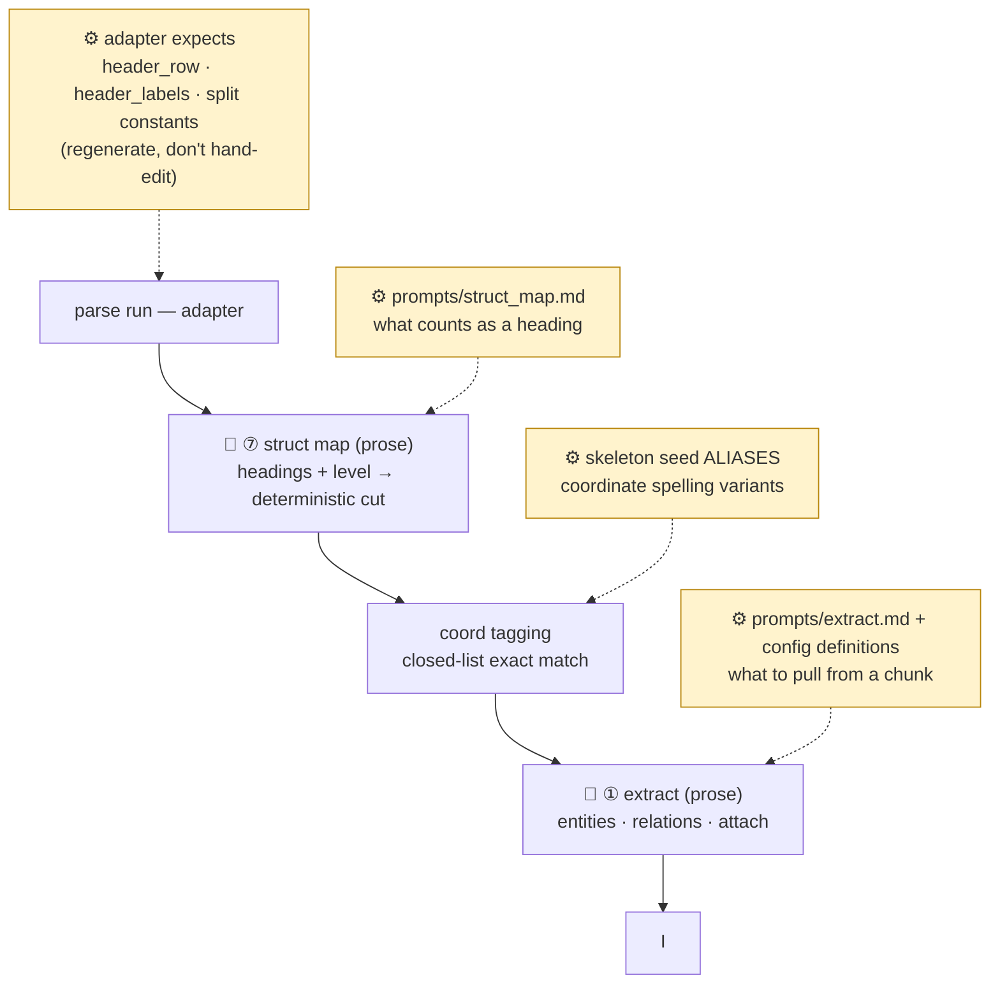
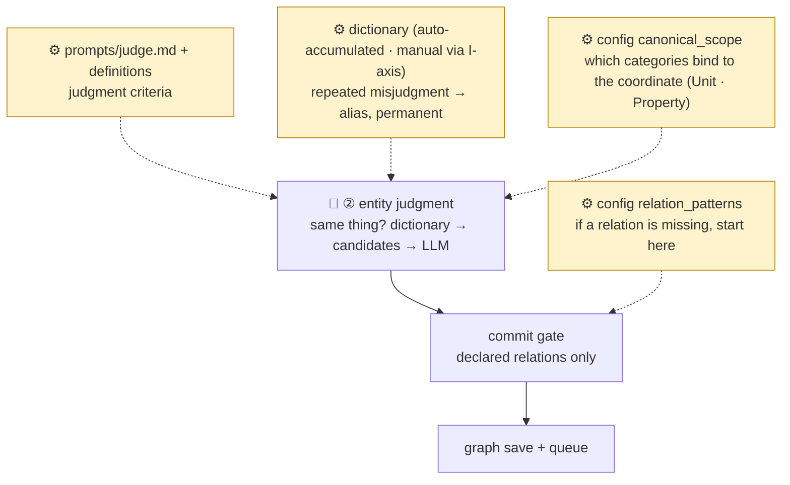
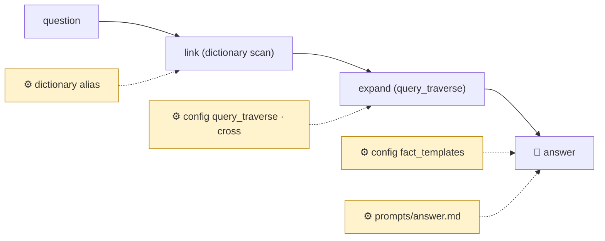

# 05 · 조절 지도 — 흐름 위에서, 어느 단계의 어떤 판단을 어느 자산이 만드나

> ← `04_질의` · 참조 `09_부품_해설`
> **독자**: 운영자. LLM의 판단이 아쉬울 때 "흐름의 어디서 잘못됐고, 그 자리를 만드는 자산이 무엇인지"를 찾는 지도다. **B48(⑦ 지시문)·B49(unmappable)·B50(AUTO_FIX·문답)·B55(문답 누적·지시 템플릿)·B58(재등록·관문 범위) 배지를 더했다.**
> **여기 없는 것**: 계기판·골든셋은 *판단을 만드는 자산*이 아니라 *측정 장치*라 이 지도의 대상이 아니다 — 04 「확인 루틴」과 가이드 §5.4를 본다.
> **읽는 법**: ⚙배지가 **사람이 조절하는 자산**이다. 배지가 꽂힌 단계의 판단만 그 자산이 바꾼다 — 다른 단계는 안 변한다.

## 등록 흐름 (doc_type 1회) — 판단이 제일 많은 곳

**★ 「뭐가 공정 정보인지 모른다」는 P2 자리다.** 정의문이 판정 프롬프트로 조립되어 문답·생성·**추출** 셋에 들어간다 — 정의문이 교과서 문장이면 판정도 교과서 수준이다. `층정의_프롬프트.md`로 사내 LLM에서 초안을 뜬다.

**뺀 열이 또 뜬다** → P3가 아니라 **스키마 `unmappable`**이 비어 있는 것이다(구판 등록분). `generate --resume`으로 스키마만 다시 뽑으면 `excluded`/`undecided`가 갈린다.

## 파싱·추출 흐름 (문서마다) — 형태와 의미

## 구축 흐름 (문서마다) — 판정·해소의 자리

## 질의 흐름

## 증상 → 자리 (요약표)

| Symptom | Stage | Asset | Takes effect |
|---|---|---|---|
| 뭐가 공정/설비/관리항목인지 모른다 | 등록·문답/생성 · 추출 | **config 정의문 (P2)** | 다음 등록·다음 추출부터 |
| 문답 질문이 빗나간다 | 등록·문답 | `interview.md` (P1) | 다음 문답부터 |
| role 배정·출력 형식이 이상하다 | 등록·생성 | 템플릿 (P3) — 판 올려서 | 다음 생성부터 |
| 이 문서만 특이하다 | 등록·생성 | 힌트/문답 (P4) | 그 등록 1회 |
| **뺀 열을 또 묻는다** | 등록·검수 | 스키마 `unmappable` 비어 있음 → `--resume` | 그 doc_type |
| **어떤 하네스 실패가 자동으로 안 풀리고 매번 묻는다** | 등록·관문 | `AUTO_FIX` (P5) — 문면이 답을 담는 실패면 추가 | 다음 생성부터 |
| **양식 표류가 뜬다** | 파싱·preflight | 어댑터 `expects` (Q0). **확정 전이면** `review --instruct`, **확정된 doc_type이면** `generate --revise`(B58 ①) | 그 doc_type |
| **등록된 doc_type을 고치려는데 「이름 중복」으로 막힌다** | 등록 | `generate --revise`(같은 이름 새 판 · 승인 이력 누적) 또는 `--as <새이름>`(변형 등록). 플래그 없이 부르면 화면이 두 경로를 적어 준다 | 그 doc_type · 옛 판으로 인입된 문서는 **자동으로 다시 안 읽는다** |
| **관문은 통과했는데 검수에서 기계 오류가 난다** | 등록·관문 | 있으면 안 되는 상태다(B58 ② 이후) — 관문이 `pipeline.parse` 전 구간을 돌므로 **남으면 그것이 결함**이다. 재현 절차와 함께 허브로 | — |
| **재생성 지시를 줬는데 초안이 안 바뀐다** | 등록·생성 | 지시는 템플릿 `{{재생성_지시}}` 자리로 조립된다(B55). `ONTO_DUMP_PROMPT=1`로 전송분을 열어 지시가 실렸는지부터 본다 | 그 생성 1회 |
| **산문 청크가 통째로 나온다 / 제목을 못 나눈다** | 파싱·⑦ | `struct_map.md` (Q7) · `source: heuristic`이면 게이트웨이 설정 | 다음 인입부터 |
| 좌표를 못 알아본다 | 파싱·태깅 | 골격 ALIASES (Q1) → `bootstrap` | bootstrap 후 |
| **청크에서 엉뚱한 것을 뽑는다 / 안 뽑는다** | 추출 | `extract.md` + 정의문 (Q8). `show extract`로 확인 → `cli.extract --force` | 재추출부터 |
| 같은 것을 딴 것으로 (또는 반대) | 구축·판정 | `judge.md`·정의문 (Q2) · 반복이면 사전 (Q3) | 다음 인입부터 |
| 노칭의 커터와 탭용접의 커터가 한 노드다 | 구축·해소 | `canonical_scope.bind_categories` (Q5) → 재인입 | `init --fresh` 후 전량 |
| 관계가 그래프에 없다 | 구축·게이트 | `relation_patterns` (Q4) — `gate_rejects.json` 먼저 | 다음 인입부터 |
| 답이 특정 표기를 못 찾는다 | 질의·링킹 | 사전 alias (R1) | 즉시 |
| 답의 사실 문장이 어색하다 | 질의·수집 | `fact_templates` (R3) | 즉시 |

## 자산의 자리는 지위다

| Location | Status | Examples |
|---|---|---|
| `kit/` | 반출 전달물 — 등록 세션이 읽는다 | 생성 템플릿 · 스켈레톤 · 참조 어댑터 · 하네스 · 렌더러 |
| `prompts/` | 운영 LLM 지점의 지시문 — **파일이 정본**(§7.6-B-5) | `extract` · `judge` · `answer` · `interview` · `image_summary` · `struct_map` |
| `layers/{층}/` | 층 자산 | `config.json` · `skeleton.json` |
| `schemas/` · `adapters/` | doc_type 자산 — **confirm이 놓는다** | 손으로 고치지 않는다 |
| `data/dictionary.json` | 축적 지식 — 자동 + I축 수동 | |

합치지 않는다. 한 화면에 모으는 것은 플랫폼 몫.

## 원칙 셋

1. **지식은 페르소나 문장이 아니라 검증 가능한 데이터로** — 정의문·골격·사전·문답 네 그릇.
2. **문답에서 한 답 중 반복될 유형은 정의문으로 승격하라** — 다음 등록부터는 안 묻는다.
3. **어댑터·스키마는 손으로 고치지 않는다** — 재생성으로 고친다. 재생성분도 기계 관문을 지난다([정정] 40). **두 경로가 다르다**: 확정 전 세션 안에서는 `review --instruct`, **이미 확정된 doc_type은 `generate --revise`**(B58 ① — `revision`이 오르고 승인 이력이 누적된다).
