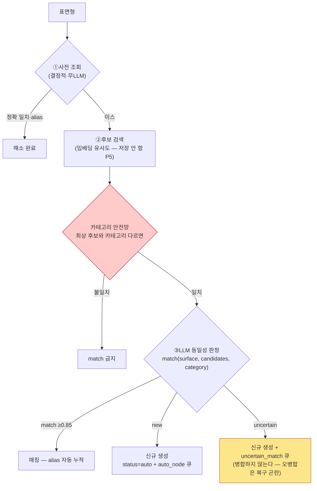
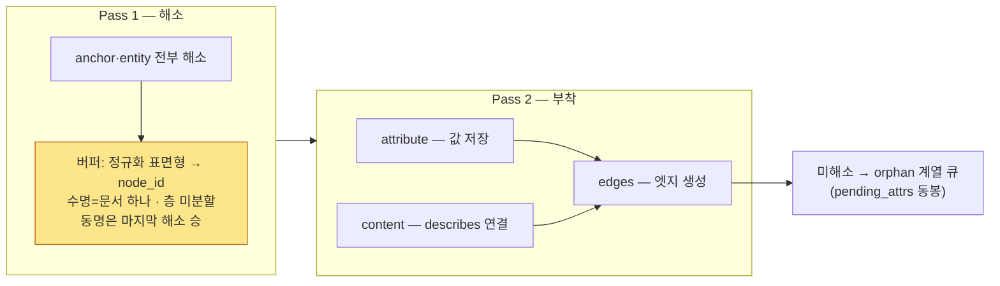
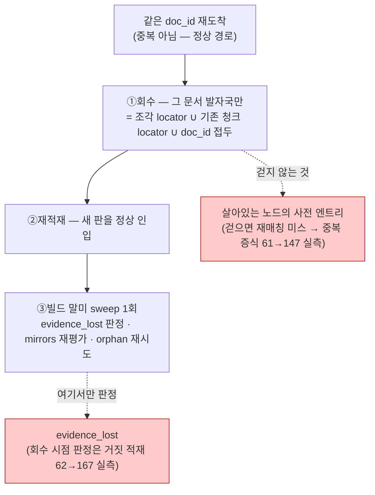
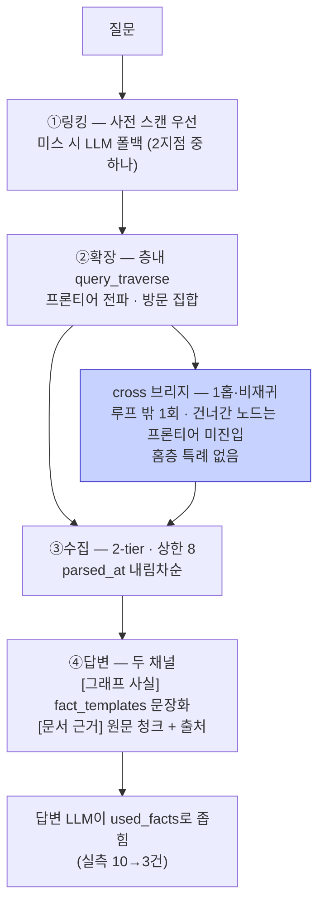

# 09 · 부품 해설 — 자산의 두 축 · 로직 도해 4곳

> ← `00_전체_지도` · **흐름은 00~05를 본다.** 부품 카드 20장(부품마다 받는 것·내는 것·어기면·사람이 할 일·명세 어느 절)은 **`부품카드.md`**다 — 생성물이고 `회귀스위트/추출_구조.py`가 매 실행 좌표·조항 참조를 검증한다.
> 이 문서는 카드에 없는 두 가지만 손으로 쓴다 — **자산의 두 축**과 **실측 사고가 났던 로직 도해 4곳**. (2026-09-28 정리: 카드 사본과 B46 이전 「한 장 지도」 스냅샷을 걷었다 — 같은 내용이 둘이면 하나가 낡는다.)
> **정본이 아니다** — 판단이 갈리면 `docs/spec/`이 이긴다.

## 자산의 두 축 — 먼저 이것부터

```
층 축 — 층마다 1벌                    doc_type 축 — 문서 종류마다 1쌍
├ layers/{층}/config.json            ├ adapters/{doc_type}.py   (파싱 어댑터)
└ layers/{층}/skeleton.json          └ schemas/{doc_type}.json  (매칭 스키마 — role 번역표)
```

**LLM이 코드·자산을 만드는 경로는 둘이다** — 지도에서 🤖→👤 로 표시된 부품:

| 경로 | 만드는 것 | 도구 |
|---|---|---|
| **구축 모드** (§6.5~6.7) | 어댑터+매칭 스키마 쌍 — **doc_type마다** | `kit/` 5종(스켈레톤·하네스·렌더러·뷰 스키마·참조어댑터·표적출력) + 지시문 `prompts/1.4_generate.md` — 표본 넣고 승인 1회 |
| **층 등록** (§3.7) | 층 config + 골격 seed — **층마다** | 골격 가이드 + config 가이드의 초안 절차 |


## 로직 도해 (2층) — 실측 사고가 났던 부품 4곳

> **왜 이 넷인가**: 전부 구현이 실제로 갈렸거나 조용히 틀렸던 자리다. 그림은 **명세의 파생물**이다 — 판단이 갈리면 명세가 이긴다. 각 도해에 명세 좌표와 실측 사고를 단다.

### 1. 판정 3분기 — "같은 개념인가" (§4.3)

**실측 사고**: 안전망이 판정 전 필터가 아니라 사후 필터로 밀려 「노칭」(Process)과 「노칭 정밀도」(Property)가 유사도로 붙을 뻔했다.



**핵심 규칙**: 임계 0.85 단일 · 불확실은 **병합이 아니라 신규**(되돌리기 쉬운 쪽으로 틀린다) · 단일 진입점 `core/matcher.py` — 재사용 3지점(attach_to 해소·orphan 재시도·I2 병합)이 전부 이 함수다. **anchor는 이 파이프라인을 타지 않는다** — 사전까지만(B10 판정: 골격은 추론으로 끌어당기지 않는다).

### 2. 2-pass — 문서 하나의 처리 (§4.2)

**실측 사고**: 버퍼의 스코프·수명이 미정이라 같은 문서의 걸침 엣지가 구현마다 다른 노드에 착지할 뻔했다.



**핵심 규칙**: 부착은 해소가 끝난 뒤에만 — 문서 안 전방 참조가 이래서 된다 · **비정형 Pass 2의 순회 단위는 레코드가 아니라 청크** — prose의 fields는 `{}`라 핸들러 루프로는 describes가 0건이 된다 · 2-pass는 **문서 단위**다(코퍼스 단위 아님 — C14).

### 3. 재인입 회수 — 개정본이 오면 (§4.8)

**실측 사고 둘**: ①사전 엔트리까지 걷어 재매칭이 전부 미스 → 노드 61→147 중복 증식 ②evidence_lost를 회수 시점에 판정 → 재적재될 항목까지 거짓 적재 62→167.



**핵심 규칙**: 회수 대상은 **문서 발자국**(provenance 항목)이지 노드가 아니다 — 노드 제거는 I4(사람)의 몫 · 멱등성 판정은 **클린 2회 동일 그래프**(그래프 바이트 동일 · 큐 집합 동일).

### 4. 질의 4단 — 질문이 답이 되기까지 (§5.1)

**실측 사고**: `recursive:false`로 도달한 노드를 프론티어에서 통째로 빼 2홉이 끊겼다 — **회귀 526건 전부 초록인 채로.**



**핵심 규칙**: 질의는 **읽기 전용**(P6) — 사전도 못 바꾼다 · `recursive:false` = "같은 관계 연속 재추적 금지"일 뿐, **다른 관계로 도달한 노드에는 적용**된다(공정→설비→인자 2홉의 근거) · 근거 밖 답변은 [일반지식] 표시.
