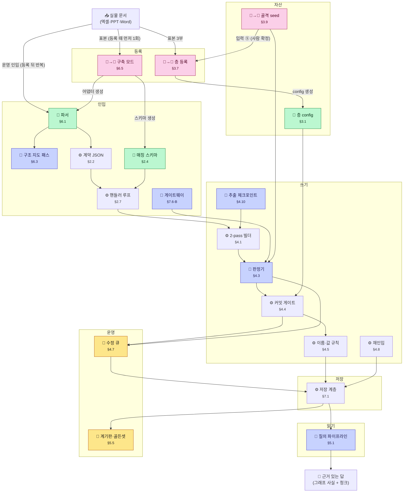

# 한 장 지도 — 문서가 답이 되기까지

> **자동 생성**(`회귀스위트/추출_구조.py`). 손으로 고치지 않는다 — 명세가 바뀌면 다시 돌린다.
> 👤 사람 · 🤖 LLM(런타임) · **🤖→👤 생성은 LLM, 확정은 사람** · 📄 자산(파일) · ⚙ 코드

## 단계가 뜻하는 것

- **등록** — 새 문서 종류·새 층을 시스템에 알린다 (구축 모드 · 운영과 분리된 별도 세션)
- **자산** — 사람이 확정해 심는 것. 코드가 아니라 데이터다
- **인입** — 문서가 계약 JSON이 되기까지
- **쓰기** — 계약 JSON이 그래프가 되기까지
- **저장** — 그래프·청크·사전·큐가 파일로 앉는 자리
- **읽기** — 질문이 근거 있는 답이 되기까지
- **운영** — 사람이 자기 리듬으로 처리하는 것
